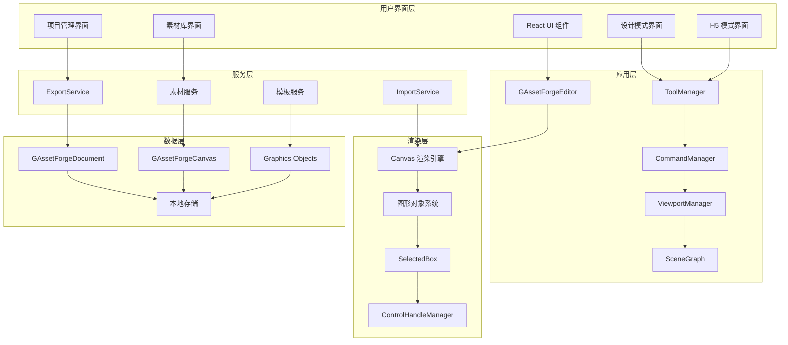
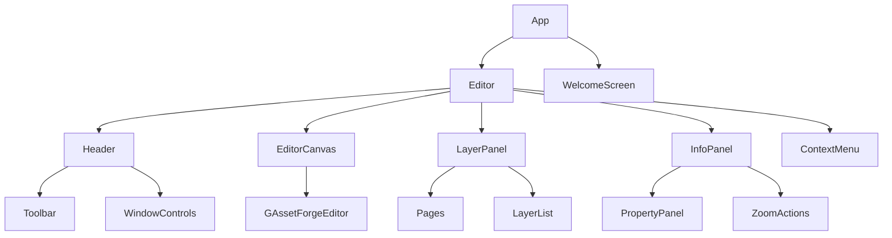
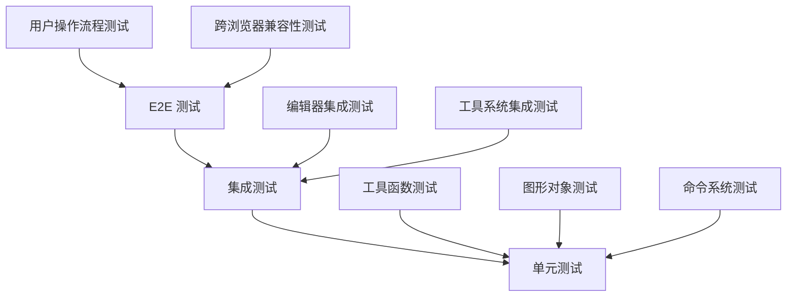

# 设计文档

## 概述

G-Asset Forge 是一个基于 Web 技术栈的专业图形编辑器，专为游戏运营素材创建而设计。该应用采用现代化的前端架构，结合高性能的 Canvas 渲染引擎，提供类似 Figma 的专业设计体验和类似秀米的 H5 长图编辑功能。

### 设计目标

- **高性能渲染**：基于 Canvas 的 60fps 流畅渲染体验
- **模块化架构**：采用 PNPM 工作空间的单体仓库架构，实现代码复用和独立开发
- **类型安全**：全面使用 TypeScript 确保代码质量和开发效率
- **跨平台支持**：Web 应用 + Electron 桌面应用双重部署
- **内网友好**：支持完全离线运行，适合企业内网环境

### 当前实现状态

项目已经实现了核心的图形编辑器功能，包括：

**已实现的核心功能**：

- ✅ 完整的编辑器核心架构 (`GAssetForgeEditor`)
- ✅ 丰富的绘图工具系统（矩形、椭圆、线条、文本、路径、多边形、星形等）
- ✅ 完善的图形对象系统和场景图管理
- ✅ 命令系统和撤销/重做功能
- ✅ 选择工具和控制手柄系统
- ✅ 视口管理和缩放功能
- ✅ 图层管理和页面系统
- ✅ 文本编辑器和路径编辑器
- ✅ 导入/导出服务
- ✅ 性能监控和优化
- ✅ 国际化支持（中英文）
- ✅ 基础 UI 组件库
- ✅ Electron 桌面应用支持

**待完善的功能**：

- 🔄 素材库管理系统
- 🔄 模板库管理系统
- 🔄 项目库管理系统
- 🔄 H5 长图编辑模式
- 🔄 批量导出功能
- 🔄 更丰富的导出格式支持

## 架构

### 整体架构图



### 技术栈选择

- **前端框架**：React 18 + TypeScript - 提供现代化的组件化开发体验
- **构建工具**：Vite + esbuild - 快速的开发和构建体验
- **包管理**：PNPM 工作空间 - 高效的单体仓库管理
- **渲染引擎**：Canvas API + 自定义图形引擎 - 高性能图形渲染
- **状态管理**：自定义事件系统 + React Context - 轻量级状态管理
- **桌面应用**：Electron - 跨平台桌面应用支持
- **样式系统**：Sass/SCSS - 强大的样式预处理器

## 组件和接口

### 核心包结构（基于现有实现）

```
packages/
├── common/           # 通用工具和类型定义
│   ├── array_util    # 数组工具函数
│   ├── color         # 颜色处理工具
│   ├── event_emitter # 事件发射器
│   └── lodash        # Lodash 工具函数封装
├── core/            # 核心图形引擎和编辑器逻辑
│   ├── commands/     # 命令系统（撤销/重做）
│   ├── graphics/     # 图形对象系统
│   ├── tools/        # 绘图工具集合
│   ├── service/      # 核心服务（导入/导出等）
│   ├── editor.ts     # 主编辑器类
│   └── ...          # 其他核心功能模块
├── geo/             # 几何计算和工具
├── components/      # React UI 组件库
│   ├── button        # 按钮组件
│   ├── dropdown      # 下拉菜单组件
│   ├── select        # 选择器组件
│   └── ...          # 其他 UI 组件
└── icons/           # 图标库
```

### 已实现的核心工具系统

项目已经实现了完整的工具系统，包括：

- **选择工具** (`SelectTool`) - 对象选择和变换
- **绘图工具** - 矩形、椭圆、线条、文本、多边形、星形
- **路径工具** (`PenTool`, `PencilTool`) - 矢量路径绘制
- **画布工具** (`DragCanvasTool`) - 画布拖拽和导航
- **专用工具** - 框架工具、图片工具、标尺辅助线工具

### 主要接口定义（基于现有实现）

#### 1. 编辑器核心接口

```typescript
// 基于现有的 GAssetForgeEditor 类
interface IEditor {
  // 画布管理
  canvasElement: HTMLCanvasElement;
  ctx: CanvasRenderingContext2D;
  containerElement: HTMLDivElement;

  // 核心管理器
  doc: GAssetForgeDocument;
  sceneGraph: SceneGraph;
  viewportManager: ViewportManager;
  toolManager: ToolManager;
  commandManager: CommandManager;

  // 功能管理器
  selectedElements: SelectedElements;
  selectedBox: SelectedBox;
  textEditor: TextEditor;
  pathEditor: PathEditor;
  guideLineManager: GuideLineManager;
  controlHandleManager: ControlHandleManager;

  // 核心方法
  render(): void;
  destroy(): void;
  setContents(data: IEditorPaperData): void;
  toScenePt(x: number, y: number, round?: boolean): IPoint;
  toViewportPt(x: number, y: number): IPoint;
  getCursorXY(event: { clientX: number; clientY: number }): IPoint;
  getSceneCursorXY(
    event: { clientX: number; clientY: number },
    round?: boolean,
  ): IPoint;
}
```

#### 2. 工具系统接口

```typescript
// 基于现有的 ITool 接口
interface ITool {
  type: string;
  cursor: ICursor;

  // 生命周期方法
  onActive(): void;
  onInactive(): void;

  // 事件处理方法
  onStart(e: PointerEvent): void;
  onDrag(e: PointerEvent): void;
  onEnd(e: PointerEvent, isDragging: boolean): void;
  afterEnd(e: PointerEvent, isDragging: boolean): void;
  onMoveExcludeDrag(e: PointerEvent, isOutsideCanvas: boolean): void;

  // 可选的事件处理
  onSpaceToggle?(isSpacePressing: boolean): void;
  onShiftToggle?(isShiftPressing: boolean): void;
  onAltToggle?(isAltPressing: boolean): void;
  onCommandChange?(): void;
  onViewportXOrYChange?(x: number, y: number): void;
  onCanvasDragActiveChange?(active: boolean): void;

  // 工具特定配置
  getDragBlockStep?(): number;
  enableActive?(): Promise<boolean>;
}
```

#### 3. 图形对象接口

```typescript
// 基于现有的图形对象系统
interface IGraphicsObject {
  attrs: GraphicsAttrs;

  // 渲染方法
  render(ctx: CanvasRenderingContext2D, renderingState: IRenderingState): void;

  // 几何方法
  getBbox(): IBox;
  getWorldTransform(): Matrix;

  // 层级管理
  getParent(): IGraphicsObject | null;
  getChildren(): IGraphicsObject[];
  insertChild(child: IGraphicsObject, index?: number): void;
  removeChild(child: IGraphicsObject): void;
  removeFromParent(): void;

  // 属性管理
  updateAttrs(partialAttrs: Partial<GraphicsAttrs>): void;

  // 状态管理
  isVisible(): boolean;
  isDeleted(): boolean;
  setDeleted(deleted: boolean): void;
}
```

#### 4. 命令系统接口

```typescript
// 基于现有的命令系统
interface ICommand {
  undo(): void;
  redo(): void;
}

interface ICommandManager {
  execute(command: ICommand): void;
  undo(): void;
  redo(): void;
  canUndo(): boolean;
  canRedo(): boolean;
  clearRecords(): void;
}
```

### 组件层次结构



## 数据模型

### 1. 编辑器数据模型（基于现有实现）

```typescript
interface IEditorPaperData {
  paperId: string;
  data: GraphicsAttrs[];
}

interface GraphicsAttrs {
  id: string;
  type: string;
  objectName?: string;

  // 基础变换属性
  x?: number;
  y?: number;
  width?: number;
  height?: number;
  rotation?: number;
  scaleX?: number;
  scaleY?: number;

  // 样式属性
  fill?: string;
  stroke?: string;
  strokeWidth?: number;
  opacity?: number;
  visible?: boolean;

  // 层级关系
  parentId?: string;
  childrenIds?: string[];

  // 类型特定属性
  [key: string]: any;
}
```

### 2. 文档和画布模型

```typescript
interface IDocumentAttrs extends GraphicsAttrs {
  type: 'Document';
  width: number;
  height: number;
  currentCanvasId?: string;
}

interface ICanvasAttrs extends GraphicsAttrs {
  type: 'Canvas';
  backgroundColor?: string;
  showGrid?: boolean;
  gridSize?: number;
}
```

### 3. 待实现的数据模型

#### 素材数据模型

```typescript
interface AssetData {
  id: string;
  name: string;
  type: 'image' | 'icon' | 'background' | 'decoration';
  category: string;
  tags: string[];

  // 文件信息
  filename: string;
  fileSize: number;
  mimeType: string;
  blob?: Blob;

  // 元数据
  width: number;
  height: number;
  thumbnail: string;

  // 使用统计
  usageCount: number;
  lastUsed: Date;
  createdAt: Date;
}
```

#### 模板数据模型

```typescript
interface TemplateData {
  id: string;
  name: string;
  description: string;
  type: 'design' | 'h5';
  category: string;
  tags: string[];

  // 预览信息
  thumbnail: string;
  previewImages: string[];

  // 模板内容
  editorData: IEditorPaperData;

  // 可变参数
  variables: TemplateVariable[];

  // 元数据
  createdAt: Date;
  updatedAt: Date;
  usageCount: number;
}

interface TemplateVariable {
  id: string;
  name: string;
  type: 'text' | 'image' | 'color';
  defaultValue: any;
  targetObjectIds: string[];
  targetProperty: string;
}
```

#### 项目数据模型

```typescript
interface ProjectData {
  id: string;
  name: string;
  description: string;
  type: 'design' | 'h5';

  // 编辑器数据
  editorData: IEditorPaperData;

  // 项目设置
  settings: {
    canvasWidth: number;
    canvasHeight: number;
    backgroundColor: string;
    exportFormat: string[];
    exportQuality: number;
  };

  // 元数据
  createdAt: Date;
  updatedAt: Date;
  lastOpenedAt: Date;

  // 关联资源
  usedAssets: string[];
  usedTemplates: string[];
}
```

## 错误处理

### 错误分类和处理策略

#### 1. 用户操作错误

- **场景**：用户输入无效数据、执行不允许的操作
- **处理**：显示友好的错误提示，引导用户正确操作
- **实现**：表单验证、操作前置检查、Toast 提示

#### 2. 文件操作错误

- **场景**：文件读取失败、保存失败、格式不支持
- **处理**：显示具体错误信息，提供重试或替代方案
- **实现**：try-catch 包装、错误码映射、用户友好提示

#### 3. 渲染错误

- **场景**：Canvas 渲染失败、内存不足、浏览器兼容性问题
- **处理**：降级渲染、错误恢复、性能优化建议
- **实现**：错误边界、性能监控、兼容性检测

```typescript
class ErrorHandler {
  static handleGlobalError(error: Error, context: string): void {
    console.error(`[${context}] ${error.message}`, error);

    const errorType = this.classifyError(error);

    if (process.env.NODE_ENV === 'development') {
      this.reportError(error, context);
    }

    this.showUserFriendlyMessage(errorType, error);
  }

  private static classifyError(error: Error): ErrorType {
    if (error instanceof ValidationError) return 'USER_INPUT';
    if (error instanceof FileError) return 'FILE_OPERATION';
    if (error instanceof RenderError) return 'RENDERING';
    return 'UNKNOWN';
  }

  private static showUserFriendlyMessage(type: ErrorType, error: Error): void {
    const messages = {
      USER_INPUT: '输入数据有误，请检查后重试',
      FILE_OPERATION: '文件操作失败，请检查文件是否存在或有权限',
      RENDERING: '渲染出现问题，请尝试刷新页面',
      UNKNOWN: '发生未知错误，请联系技术支持',
    };

    // 使用现有的通知系统显示错误
    console.error(messages[type] || messages.UNKNOWN);
  }
}
```

## 测试策略

### 测试金字塔



### 1. 单元测试

**覆盖范围**：

- 工具函数和算法（`@g-asset-forge/common`, `@g-asset-forge/geo`）
- 图形对象的几何计算和变换
- 命令系统的撤销/重做逻辑
- 工具系统的状态管理

**测试框架**：Jest + ts-jest

```typescript
// 示例：图形对象测试
describe('Graphics Object', () => {
  test('应该正确计算边界框', () => {
    const rect = new GAssetForgeRect({
      x: 10,
      y: 20,
      width: 100,
      height: 50,
    });

    const bbox = rect.getBbox();
    expect(bbox).toEqual({
      x: 10,
      y: 20,
      width: 100,
      height: 50,
    });
  });

  test('应该正确应用变换', () => {
    const rect = new GAssetForgeRect({
      x: 0,
      y: 0,
      width: 100,
      height: 100,
      rotation: Math.PI / 2,
    });

    expect(rect.attrs.rotation).toBeCloseTo(Math.PI / 2);
  });
});
```

### 2. 集成测试

**覆盖范围**：

- 编辑器核心功能集成
- 工具系统与渲染引擎集成
- 命令系统与编辑器集成
- React 组件与编辑器集成

```typescript
// 示例：编辑器集成测试
describe('Editor Integration', () => {
  let editor: GAssetForgeEditor;

  beforeEach(() => {
    const container = document.createElement('div');
    editor = new GAssetForgeEditor({
      containerElement: container,
      width: 800,
      height: 600,
    });
  });

  afterEach(() => {
    editor.destroy();
  });

  test('应该能够创建和选择对象', () => {
    // 切换到矩形工具
    editor.toolManager.setActiveTool('DrawRect');

    // 模拟绘制矩形
    const startEvent = new PointerEvent('pointerdown', {
      clientX: 100,
      clientY: 100,
    });
    const endEvent = new PointerEvent('pointerup', {
      clientX: 200,
      clientY: 200,
    });

    // 执行绘制操作
    // ... 测试逻辑

    expect(editor.doc.getCurrentCanvas()?.getChildren().length).toBe(1);
  });
});
```

### 3. E2E 测试

**覆盖范围**：

- 完整的用户操作流程
- 文件导入导出功能
- 工具切换和使用
- 性能基准测试

**测试工具**：Playwright

```typescript
// 示例：E2E 测试
test('用户应该能够创建和编辑设计项目', async ({ page }) => {
  await page.goto('/');

  // 跳过欢迎页面
  await page.click('[data-testid="start-button"]');

  // 等待编辑器加载
  await page.waitForSelector('.editor-canvas-container');

  // 选择矩形工具
  await page.click('[data-testid="rect-tool"]');

  // 在画布上绘制矩形
  const canvas = page.locator('canvas');
  await canvas.click({ position: { x: 100, y: 100 } });
  await canvas.click({ position: { x: 200, y: 200 } });

  // 验证矩形已创建
  // ... 验证逻辑
});
```

## 性能优化策略

### 1. 渲染性能优化（基于现有实现）

项目已经实现了多项性能优化：

#### 已实现的优化

- ✅ **性能监控**：`PerfMonitor` 类实时监控渲染性能
- ✅ **RAF 节流**：`rafThrottle` 工具函数优化高频操作
- ✅ **视口管理**：`ViewportManager` 优化缩放和平移性能
- ✅ **事件节流**：使用 `throttle` 优化窗口 resize 事件

#### 待优化的方面

```typescript
class CanvasRenderer {
  private dirtyRegions: Rectangle[] = [];
  private renderCache = new Map<string, OffscreenCanvas>();

  // 脏区域渲染
  markDirty(region: Rectangle): void {
    this.dirtyRegions.push(region);
  }

  // 离屏渲染缓存
  getCachedRender(objectId: string): OffscreenCanvas | null {
    return this.renderCache.get(objectId) || null;
  }

  setCachedRender(objectId: string, canvas: OffscreenCanvas): void {
    this.renderCache.set(objectId, canvas);
  }
}
```

### 2. 内存管理

#### 基于现有的资源管理

```typescript
// 基于现有的 ImgManager
class ResourceManager extends ImgManager {
  private usageCount = new Map<string, number>();

  // 扩展现有的图片管理功能
  loadImageWithUsageTracking(url: string): Promise<HTMLImageElement> {
    this.incrementUsage(url);
    return this.loadImg(url);
  }

  releaseImage(url: string): void {
    const count = this.decrementUsage(url);
    if (count <= 0) {
      // 清理缓存
      this.clearImageCache(url);
    }
  }

  private incrementUsage(url: string): void {
    const count = this.usageCount.get(url) || 0;
    this.usageCount.set(url, count + 1);
  }

  private decrementUsage(url: string): number {
    const count = this.usageCount.get(url) || 0;
    const newCount = Math.max(0, count - 1);
    this.usageCount.set(url, newCount);
    return newCount;
  }
}
```

### 3. 数据处理优化

#### 基于现有的存储系统

```typescript
// 扩展现有的 AutoSaveGraphics 功能
class OptimizedDataManager extends AutoSaveGraphics {
  private compressionEnabled = true;

  // 压缩存储
  saveCompressed(data: IEditorPaperData): void {
    if (this.compressionEnabled) {
      const compressed = this.compressData(data);
      localStorage.setItem(this.getStorageKey(), compressed);
    } else {
      this.save(data);
    }
  }

  private compressData(data: IEditorPaperData): string {
    // 实现数据压缩逻辑
    return JSON.stringify(data);
  }
}
```

这个优化后的设计文档基于项目的实际实现状态，更准确地反映了当前的架构和已实现的功能，同时为待开发的功能提供了清晰的设计指导。
