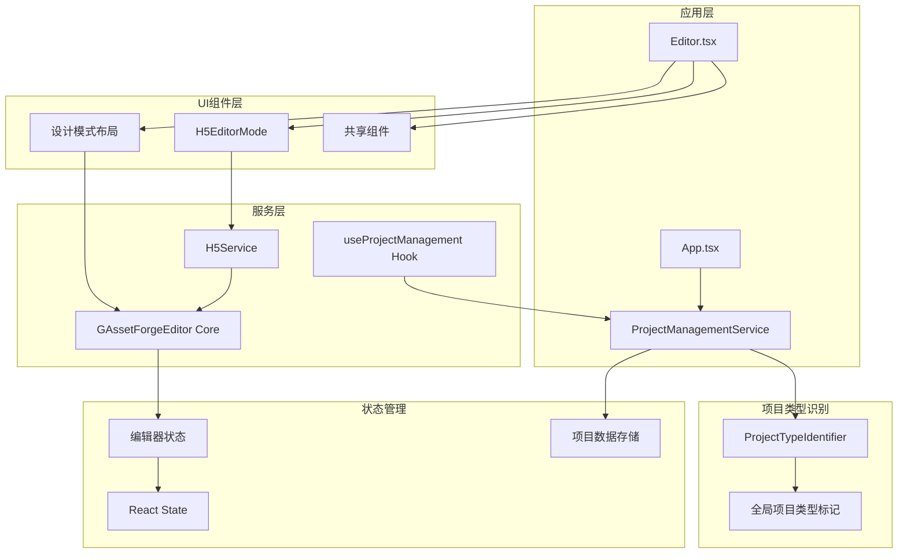
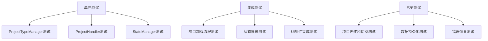

# 设计文档

## 概述

H5 模式隔离设计旨在基于现有的 G-Asset Forge 编辑器核心，实现设计项目和 H5 项目的完全状态隔离。通过重构项目管理、状态管理和 UI 组件架构，确保每个项目类型在独立的环境中运行，避免状态污染和数据冲突。

### 设计目标

- **项目类型隔离**：设计项目和 H5 项目完全独立，不支持类型切换
- **状态管理隔离**：每种项目类型拥有独立的状态管理系统
- **数据格式隔离**：不同项目类型使用专门的数据格式和存储结构
- **UI 组件隔离**：根据项目类型显示对应的 UI 布局和组件
- **服务实例隔离**：H5 项目使用独立的 H5Service 实例管理

### 当前问题分析

基于对现有代码的分析，主要问题包括：

1. **状态共享污染**：设计项目和 H5 项目共享编辑器状态，导致状态冲突
2. **初始化时序问题**：H5EditorMode 和 ProjectManagementService 初始化时机冲突
3. **数据管理混乱**：两种项目类型的数据在同一画布上混合
4. **服务生命周期管理**：H5Service 实例没有正确的创建和销毁机制

## 架构设计

### 整体架构图（基于实际实现）



### 核心组件设计（基于实际实现）

#### 1. 项目管理服务 (ProjectManagementService)

现有的项目管理服务已经实现了基本的项目类型识别和管理功能。

```typescript
// 基于现有实现的ProjectManagementService
class ProjectManagementService extends EventEmitter<ProjectManagementEvents> {
  private storageService: ProjectStorageService;
  private autoSaveService: ProjectAutoSave | null = null;
  private autoExportService: AutoExportService;
  private editor: GAssetForgeEditor | null = null;
  private currentProjectId: string | null = null;

  // 项目类型识别 - 现有实现
  private checkIfProjectHasH5Container(editorData: any): boolean {
    try {
      if (!editorData || !editorData.data || !Array.isArray(editorData.data)) {
        return false;
      }

      return editorData.data.some((item: any) => {
        return (
          item.type === 'H5Container' ||
          item.attrs?.type === 'H5Container' ||
          (item.type && item.type.toString() === 'H5Container')
        );
      });
    } catch (error) {
      console.warn('检查H5容器时出错:', error);
      return false;
    }
  }

  // 项目打开 - 现有实现
  async openProject(projectId: string): Promise<boolean> {
    // 加载项目数据
    const projectData =
      (await this.loadProjectFromAutoExport(projectId)) ||
      (await this.storageService.loadProject(projectId));

    if (!projectData) return false;

    // 设置项目类型标记
    const hasH5Container = this.checkIfProjectHasH5Container(
      projectData.editorData,
    );

    if (hasH5Container) {
      (window as any).__isH5Project = true;
      (window as any).__projectType = 'h5';
    } else {
      (window as any).__isH5Project = false;
      (window as any).__projectType = 'design';
    }

    // 清理编辑器状态
    this.clearEditorState();

    // 设置编辑器内容
    if (this.editor) {
      this.editor.setContents(projectData.editorData);
    }

    this.currentProjectId = projectId;
    this.emit('projectOpened', projectData);
    return true;
  }

  // 编辑器状态清理 - 现有实现
  private clearEditorState(): void {
    if (!this.editor) return;

    try {
      // 清理画布上的所有元素
      const currentCanvas = this.editor.doc.getCurrentCanvas();
      if (currentCanvas) {
        const children = currentCanvas.getChildren();
        children.forEach((child) => {
          currentCanvas.removeChild(child);
        });
      }

      // 清理选择状态
      if (this.editor.selectedElements) {
        this.editor.selectedElements.clear();
      }

      // 重置视口
      if (this.editor.viewportManager) {
        this.editor.viewportManager.setViewportSize({
          width: 800,
          height: 600,
        });
        this.editor.viewportManager.setZoom(1, { x: 0, y: 0 });
      }
    } catch (error) {
      console.warn('清理编辑器状态时出错:', error);
    }
  }
}
```

#### 2. H5Service 集成 (基于现有实现)

现有的 H5Service 已经实现了 H5 项目的核心功能，包括容器管理和内容块操作。

```typescript
// 基于现有实现的H5Service
export class H5Service {
  private editor: GAssetForgeEditor;
  private currentContainer: H5Container | null = null;

  constructor(editor: GAssetForgeEditor) {
    this.editor = editor;
    this.startContainerMonitoring();
  }

  // 初始化H5模式 - 现有实现
  initializeH5Mode(): H5Container {
    const currentCanvas = this.editor.doc.getCurrentCanvas();
    if (!currentCanvas) {
      throw new Error('无法获取当前画布');
    }

    // 创建H5容器
    this.currentContainer = new H5Container(
      {
        id: `h5_container_${Date.now()}`,
        objectName: 'H5长图容器',
        width: 1080,
        height: 2220,
        mobileWidth: 1080,
        padding: 16,
        gap: 12,
        autoLayout: true,
        transform: [1, 0, 0, 1, 0, 0], // 左上角对齐
        fill: [
          {
            type: PaintType.Solid,
            attrs: { r: 255, g: 255, b: 255, a: 1 },
            visible: true,
          },
        ],
        stroke: [
          {
            type: PaintType.Solid,
            attrs: { r: 100, g: 100, b: 100, a: 1 },
            visible: true,
          },
        ],
        strokeWidth: 2,
      },
      { doc: this.editor.doc } as any,
    );

    // 添加到画布
    currentCanvas.insertChild(this.currentContainer as any);

    // 调整视口
    this.centerViewportOnContainer();
    this.editor.render();

    return this.currentContainer;
  }

  // 恢复现有H5容器 - 现有实现
  restoreExistingH5Container(existingContainer: any): boolean {
    try {
      if (existingContainer.type !== 'H5Container') {
        return false;
      }

      this.currentContainer = existingContainer;

      const currentCanvas = this.editor.doc.getCurrentCanvas();
      if (currentCanvas) {
        const containerInCanvas = currentCanvas
          .getChildren()
          .find((child) => child.attrs.id === existingContainer.attrs.id);

        if (!containerInCanvas) {
          currentCanvas.insertChild(existingContainer);
        }
      }

      this.centerViewportOnContainer();
      this.editor.render();
      return true;
    } catch (error) {
      console.error('恢复H5容器失败:', error);
      return false;
    }
  }

  // 内容块管理 - 现有实现
  addTextBlock(content: string = '请输入文本内容'): H5TextBlock | null {
    if (!this.currentContainer) return null;

    const textBlock = this.currentContainer.addContentBlock({
      blockType: 'text',
      content,
      fontSize: 16,
      textAlign: 'left',
      textColor: '#333333',
      marginTop: 8,
      marginBottom: 8,
      paddingTop: 12,
      paddingBottom: 12,
      paddingLeft: 16,
      paddingRight: 16,
    }) as unknown as H5TextBlock;

    this.editor.render();
    return textBlock;
  }

  // 其他内容块操作方法...
  addImageBlock(src: string = '', alt: string = '图片'): H5ImageBlock | null {
    /* ... */
  }
  addButtonBlock(text: string = '点击按钮'): H5ButtonBlock | null {
    /* ... */
  }
  removeContentBlock(blockId: string): boolean {
    /* ... */
  }
  updateContentBlock(
    blockId: string,
    attrs: Partial<H5ContentBlockAttrs>,
  ): boolean {
    /* ... */
  }
}
```

#### 3. H5EditorMode 组件 (基于现有实现)

现有的 H5EditorMode 组件已经实现了 H5 模式的 UI 布局和交互逻辑。

```typescript
// 基于现有实现的H5EditorMode
export const H5EditorMode: FC<H5EditorModeProps> = ({ containerRef }) => {
  const editor = useContext(EditorContext);
  const h5ServiceRef = useRef<H5Service | null>(null);
  const [selectedBlockId, setSelectedBlockId] = useState<string>('');
  const [contentBlocks, setContentBlocks] = useState<any[]>([]);

  useEffect(() => {
    if (editor && containerRef?.current) {
      // 初始化H5Service
      h5ServiceRef.current = new H5Service(editor.editor);

      // 检查是否是现有H5项目
      const isExistingH5Project = (window as any).__isH5Project;

      if (isExistingH5Project) {
        // 等待ProjectManagementService完成数据加载
        const waitForH5Container = () => {
          const currentCanvas = editor?.editor?.doc?.getCurrentCanvas();
          const editorData = currentCanvas?.getChildren();

          if (editorData && editorData.length > 0) {
            const h5Container = editorData.find(
              (child: any) => child && child.type === 'H5Container',
            );

            if (h5Container) {
              // 直接使用现有H5容器
              h5ServiceRef.current!.setCurrentContainer(h5Container as any);
              delete (window as any).__isH5Project;
              delete (window as any).__projectType;
              return;
            }
          }

          // 继续等待或超时后初始化新容器
          const elapsedTime = Date.now() - ((window as any).__h5WaitStartTime || 0);
          if (elapsedTime < 5000) {
            setTimeout(waitForH5Container, 100);
          } else {
            h5ServiceRef.current!.initializeH5Mode();
            delete (window as any).__isH5Project;
            delete (window as any).__projectType;
          }
        };

        (window as any).__h5WaitStartTime = Date.now();
        setTimeout(waitForH5Container, 200);
      } else {
        // 新建H5项目
        h5ServiceRef.current.initializeH5Mode();
      }

      // 更新内容块列表
      updateContentBlocksList();
      editor?.editor?.render();

      return () => {
        // 清理H5Service
        if (h5ServiceRef.current) {
          h5ServiceRef.current.destroy();
          h5ServiceRef.current = null;
        }
      };
    }
  }, [editor, containerRef]);

  // UI渲染和事件处理...
  return (
    <div className="h5-editor-mode">
      <div className="h5-left-panel">
        <ContentBlockPanel /* props */ />
      </div>
      <div className="h5-canvas-area">
        <div ref={containerRef} className="editor-canvas-wrapper">
          <H5Canvas /* props */ />
        </div>
      </div>
      <div className="h5-right-panel">
        {showPropertyPanel && selectedBlock ? (
          <H5PropertyPanel /* props */ />
        ) : (
          <div className="h5-property-panel-placeholder">
            <div className="placeholder-content">
              <div className="placeholder-title">属性面板</div>
              <div className="placeholder-text">选择一个内容块来编辑其属性</div>
            </div>
          </div>
        )}
      </div>
    </div>
  );
};

  constructor() {
    this.stateManager = new H5StateManager();
  }

  async initializeProject(editor: GAssetForgeEditor): Promise<void> {
    this.editor = editor;

    // 创建H5Service实例
    this.h5Service = new H5Service(editor);

    // 配置编辑器为H5模式
    this.configureH5Mode();

    // 初始化状态管理
    await this.stateManager.initialize(editor, this.h5Service);
  }

  async loadProjectData(projectData: any): Promise<boolean> {
    try {
      // 验证H5项目数据格式
      if (!this.validateH5ProjectData(projectData)) {
        return false;
      }

      // 加载项目数据到编辑器
      this.editor.setContents(projectData);

      // 初始化H5Container
      await this.h5Service.initializeFromData(projectData);

      // 恢复项目状态
      await this.stateManager.restoreState(projectData.state);

      return true;
    } catch (error) {
      console.error('H5项目数据加载失败:', error);
      return false;
    }
  }

  async saveProjectData(): Promise<any> {
    const editorData = this.editor.getContents();
    const h5Data = this.h5Service.exportData();
    const currentState = this.stateManager.getCurrentState();

    return {
      type: 'h5',
      data: editorData,
      h5Container: h5Data.h5Container,
      contentBlocks: h5Data.contentBlocks,
      state: currentState,
      metadata: {
        createdAt: new Date(),
        version: '1.0.0',
      },
    };
  }

  async cleanup(): Promise<void> {
    if (this.h5Service) {
      await this.h5Service.cleanup();
      this.h5Service = null;
    }
    await this.stateManager.cleanup();
    this.editor = null;
  }

  private configureH5Mode(): void {
    // 配置编辑器为H5模式
    // 启用H5特定功能
  }

  private validateH5ProjectData(data: any): boolean {
    return data && (data.h5Container || data.type === 'h5');
  }
}
```

#### 4. 状态管理隔离器 (EditorStateIsolator)

负责隔离和管理不同项目类型的编辑器状态。

```typescript
class EditorStateIsolator {
  private currentProjectType: 'design' | 'h5' | null = null;
  private stateManagers: Map<string, StateManager> = new Map();

  // 设置当前项目类型
  setCurrentProjectType(type: 'design' | 'h5'): void {
    this.currentProjectType = type;
  }

  // 获取当前状态管理器
  getCurrentStateManager(): StateManager | null {
    if (!this.currentProjectType) return null;
    return this.stateManagers.get(this.currentProjectType) || null;
  }

  // 注册状态管理器
  registerStateManager(type: 'design' | 'h5', manager: StateManager): void {
    this.stateManagers.set(type, manager);
  }

  // 清理所有状态
  async cleanup(): Promise<void> {
    for (const [type, manager] of this.stateManagers) {
      await manager.cleanup();
    }
    this.stateManagers.clear();
    this.currentProjectType = null;
  }
}

interface StateManager {
  initialize(editor: GAssetForgeEditor, ...args: any[]): Promise<void>;
  getCurrentState(): any;
  restoreState(state: any): Promise<void>;
  cleanup(): Promise<void>;
}
```

#### 5. 设计状态管理器 (DesignStateManager)

管理设计项目的状态，包括页面、图层、选择等。

```typescript
class DesignStateManager implements StateManager {
  private editor: GAssetForgeEditor;
  private currentState: DesignProjectState;

  async initialize(editor: GAssetForgeEditor): Promise<void> {
    this.editor = editor;
    this.currentState = this.createInitialState();
    this.setupEventListeners();
  }

  getCurrentState(): DesignProjectState {
    return {
      ...this.currentState,
      selectedElements: this.editor.selectedElements
        .getItems()
        .map((item) => item.attrs.id),
      currentPage: this.editor.doc.getCurrentCanvas()?.attrs.id || null,
      viewport: {
        zoom: this.editor.viewportManager.getZoom(),
        offset: this.editor.viewportManager.getOffset(),
      },
    };
  }

  async restoreState(state: DesignProjectState): Promise<void> {
    if (!state) return;

    // 恢复选择状态
    if (state.selectedElements?.length > 0) {
      // 恢复选择的元素
    }

    // 恢复页面状态
    if (state.currentPage) {
      // 切换到指定页面
    }

    // 恢复视口状态
    if (state.viewport) {
      this.editor.viewportManager.setZoom(state.viewport.zoom);
      this.editor.viewportManager.setOffset(state.viewport.offset);
    }

    this.currentState = { ...state };
  }

  async cleanup(): Promise<void> {
    this.removeEventListeners();
    this.currentState = null;
    this.editor = null;
  }

  private createInitialState(): DesignProjectState {
    return {
      selectedElements: [],
      currentPage: null,
      viewport: { zoom: 1, offset: { x: 0, y: 0 } },
      toolSettings: {},
      uiState: {
        showPages: true,
        showLayers: true,
        showProperties: true,
      },
    };
  }

  private setupEventListeners(): void {
    // 监听编辑器状态变化
  }

  private removeEventListeners(): void {
    // 移除事件监听器
  }
}

interface DesignProjectState {
  selectedElements: string[];
  currentPage: string | null;
  viewport: { zoom: number; offset: { x: number; y: number } };
  toolSettings: any;
  uiState: {
    showPages: boolean;
    showLayers: boolean;
    showProperties: boolean;
  };
}
```

#### 6. H5 状态管理器 (H5StateManager)

管理 H5 项目的状态，包括容器、内容块、布局等。

```typescript
class H5StateManager implements StateManager {
  private editor: GAssetForgeEditor;
  private h5Service: H5Service;
  private currentState: H5ProjectState;

  async initialize(
    editor: GAssetForgeEditor,
    h5Service: H5Service,
  ): Promise<void> {
    this.editor = editor;
    this.h5Service = h5Service;
    this.currentState = this.createInitialState();
    this.setupEventListeners();
  }

  getCurrentState(): H5ProjectState {
    return {
      ...this.currentState,
      selectedBlocks: this.h5Service
        .getSelectedContentBlocks()
        .map((block) => block.id),
      currentContainer: this.h5Service.getCurrentContainer()?.id || null,
      viewport: {
        zoom: this.editor.viewportManager.getZoom(),
        offset: this.editor.viewportManager.getOffset(),
      },
    };
  }

  async restoreState(state: H5ProjectState): Promise<void> {
    if (!state) return;

    // 恢复选择的内容块
    if (state.selectedBlocks?.length > 0) {
      // 恢复选择状态
    }

    // 恢复容器状态
    if (state.currentContainer) {
      // 设置当前容器
    }

    // 恢复视口状态
    if (state.viewport) {
      this.editor.viewportManager.setZoom(state.viewport.zoom);
      this.editor.viewportManager.setOffset(state.viewport.offset);
    }

    this.currentState = { ...state };
  }

  async cleanup(): Promise<void> {
    this.removeEventListeners();
    this.currentState = null;
    this.h5Service = null;
    this.editor = null;
  }

  private createInitialState(): H5ProjectState {
    return {
      selectedBlocks: [],
      currentContainer: null,
      viewport: { zoom: 1, offset: { x: 0, y: 0 } },
      layoutSettings: {
        autoLayout: true,
        padding: 20,
        gap: 10,
      },
      uiState: {
        showContentBlocks: true,
        showLayers: true,
        showProperties: true,
      },
    };
  }

  private setupEventListeners(): void {
    // 监听H5Service状态变化
  }

  private removeEventListeners(): void {
    // 移除事件监听器
  }
}

interface H5ProjectState {
  selectedBlocks: string[];
  currentContainer: string | null;
  viewport: { zoom: number; offset: { x: number; y: number } };
  layoutSettings: {
    autoLayout: boolean;
    padding: number;
    gap: number;
  };
  uiState: {
    showContentBlocks: boolean;
    showLayers: boolean;
    showProperties: boolean;
  };
}
```

## 组件和接口

### UI 组件隔离设计（基于实际实现）

#### 1. 模式布局组件

```typescript
// 设计模式布局 - 基于Editor.tsx的实际实现
const DesignModeLayout = () => {
  return (
    <>
      <div className="g-asset-forge-editor-left-area">
        <Pages />
        <LayerPanel />
      </div>
      <div ref={containerRef} className="editor-canvas-container" />
      <InfoPanel />
      <ContextMenu />
    </>
  );
};

// H5模式布局 - 基于H5EditorMode.tsx的实际实现
const H5ModeLayout = ({ containerRef }) => {
  return (
    <div className="h5-editor-mode g-asset-forge-h5-mode">
      {/* 左侧面板 - ContentBlockPanel包含内容块和图层两个标签页 */}
      <div className="h5-left-panel">
        <ContentBlockPanel
          onBlockAdd={handleBlockAdd}
          selectedBlockId={selectedBlockId}
          contentBlocks={contentBlocks}
          onBlockSelect={handleBlockSelect}
          onBlockDelete={handleBlockDelete}
          onBlockReorder={handleBlockReorder}
          allElements={allElements} // 传递所有元素用于图层显示
        />
      </div>

      {/* H5画布区域 */}
      <div className="h5-canvas-area">
        <div ref={containerRef} className="editor-canvas-wrapper">
          <H5Canvas /* props */ />
        </div>
      </div>

      {/* 右侧属性面板 */}
      <div className="h5-right-panel">
        {showPropertyPanel && selectedBlock ? (
          <H5PropertyPanel /* props */ />
        ) : (
          <div className="h5-property-panel-placeholder">
            <div className="placeholder-content">
              <div className="placeholder-title">属性面板</div>
              <div className="placeholder-text">选择一个内容块来编辑其属性</div>
            </div>
          </div>
        )}
      </div>
    </div>
  );
};
```

#### 2. ContentBlockPanel - 集成内容块和图层管理

H5 模式的左侧面板实际上是一个集成了内容块选择和图层管理的组件，通过标签页切换两种功能。

```typescript
// 基于实际实现的ContentBlockPanel
export const ContentBlockPanel: FC<ContentBlockPanelProps> = ({
  onBlockAdd,
  selectedBlockId,
  contentBlocks,
  onBlockSelect,
  onBlockDelete,
  onBlockReorder,
  allElements = [], // 所有元素，用于图层显示
}) => {
  const [activeTab, setActiveTab] = useState<'blocks' | 'layers'>('blocks');

  return (
    <div className="content-block-panel">
      {/* 面板头部 - 标签页切换 */}
      <div className="panel-header">
        <div className="panel-tabs">
          <button
            className={`tab-button ${activeTab === 'blocks' ? 'active' : ''}`}
            onClick={() => setActiveTab('blocks')}
          >
            内容块
          </button>
          <button
            className={`tab-button ${activeTab === 'layers' ? 'active' : ''}`}
            onClick={() => setActiveTab('layers')}
          >
            图层
          </button>
        </div>
      </div>

      {/* 内容块选择区 */}
      {activeTab === 'blocks' && (
        <div className="blocks-section">
          <div className="section-title">组件库</div>
          <div className="block-types">
            {blockTypes.map((blockType) => (
              <div
                key={blockType.type}
                className="block-type-item"
                onClick={() => onBlockAdd(blockType.type)}
              >
                <div className="block-icon">{blockType.icon}</div>
                <div className="block-name">{blockType.name}</div>
              </div>
            ))}
          </div>
        </div>
      )}

      {/* 图层管理区 - 显示H5容器和所有子元素 */}
      {activeTab === 'layers' && (
        <div className="layers-section">
          <div className="section-title">图层 ({allElements.length})</div>
          <div className="layer-list">
            {allElements.map((element, index) => {
              const isSelected = selectedBlockId === element.attrs?.id;
              const elementType = element.type || element.attrs?.type || 'unknown';
              const elementName = element.attrs?.objectName ||
                                element.attrs?.id ||
                                `图层 ${index + 1}`;

              return (
                <div
                  key={element.attrs?.id || index}
                  className={`layer-item ${isSelected ? 'selected' : ''}`}
                  onClick={() => onBlockSelect(element.attrs?.id || '')}
                  draggable
                >
                  <div className="layer-drag-handle">⋮⋮</div>
                  <div className="layer-icon">
                    {/* 根据元素类型显示不同图标 */}
                    {elementType === 'H5Container' ? '📱' :
                     elementType === 'H5TextBlock' ? <TextFilled /> :
                     elementType === 'H5ImageBlock' ? <ImageOutlined /> :
                     elementType === 'H5ButtonBlock' ? <AddOutlined /> :
                     elementType === 'Rect' ? '⬜' :
                     elementType === 'Ellipse' ? '⭕' : '🔷'}
                  </div>
                  <div className="layer-info">
                    <div className="layer-name">{elementName}</div>
                    <div className="layer-type">{elementType}</div>
                  </div>
                  <div className="layer-actions">
                    <button
                      className="delete-button"
                      onClick={(e) => {
                        e.stopPropagation();
                        onBlockDelete(element.attrs?.id || '');
                      }}
                    >
                      <RemoveOutlined />
                    </button>
                  </div>
                </div>
              );
            })}
          </div>
        </div>
      )}
    </div>
  );
};
          onSelect={mode === 'design' ? handleDesignSelect : handleH5Select}
        />
      ))}
    </div>
  );
};
```

### 数据模型

#### 1. 项目数据格式

```typescript
// 设计项目数据格式
interface DesignProjectData {
  type: 'design';
  data: GraphicsAttrs[];
  state?: DesignProjectState;
  metadata: {
    createdAt: Date;
    updatedAt: Date;
    version: string;
  };
}

// H5项目数据格式
interface H5ProjectData {
  type: 'h5';
  data: GraphicsAttrs[];
  h5Container: H5ContainerData;
  contentBlocks: ContentBlockData[];
  state?: H5ProjectState;
  metadata: {
    createdAt: Date;
    updatedAt: Date;
    version: string;
  };
}

// H5容器数据
interface H5ContainerData {
  id: string;
  type: 'H5Container';
  width: number;
  height: number;
  backgroundColor: string;
  padding: number;
  gap: number;
  autoLayout: boolean;
  childrenIds: string[];
}

// 内容块数据
interface ContentBlockData {
  id: string;
  type: 'TextBlock' | 'ImageBlock' | 'ButtonBlock';
  parentId: string;
  order: number;
  content: any;
  style: any;
}
```

#### 2. 项目类型识别

```typescript
class ProjectTypeIdentifier {
  static identifyType(projectData: any): 'design' | 'h5' {
    // 优先检查明确的类型标识
    if (projectData.type === 'design' || projectData.type === 'h5') {
      return projectData.type;
    }

    // 检查是否包含H5Container
    if (projectData.h5Container || this.hasH5Container(projectData.data)) {
      return 'h5';
    }

    // 默认为设计项目
    return 'design';
  }

  private static hasH5Container(data: GraphicsAttrs[]): boolean {
    return data?.some((item) => item.type === 'H5Container') || false;
  }
}
```

## 错误处理

### 错误分类和处理策略

#### 1. 项目类型识别错误

```typescript
class ProjectTypeError extends Error {
  constructor(message: string, public projectData: any) {
    super(message);
    this.name = 'ProjectTypeError';
  }
}

class ProjectTypeErrorHandler {
  static handle(error: ProjectTypeError): 'design' | 'h5' {
    console.error('项目类型识别失败:', error.message);

    // 尝试从数据结构推断
    if (error.projectData?.h5Container) {
      return 'h5';
    }

    // 默认返回设计类型
    return 'design';
  }
}
```

#### 2. 状态管理错误

```typescript
class StateManagementError extends Error {
  constructor(message: string, public stateType: 'design' | 'h5') {
    super(message);
    this.name = 'StateManagementError';
  }
}

class StateErrorHandler {
  static async handle(error: StateManagementError): Promise<void> {
    console.error(`${error.stateType}状态管理错误:`, error.message);

    // 尝试重置状态
    try {
      await this.resetState(error.stateType);
    } catch (resetError) {
      console.error('状态重置失败:', resetError);
    }
  }

  private static async resetState(type: 'design' | 'h5'): Promise<void> {
    // 实现状态重置逻辑
  }
}
```

#### 3. 服务实例错误

```typescript
class ServiceInstanceError extends Error {
  constructor(message: string, public serviceType: string) {
    super(message);
    this.name = 'ServiceInstanceError';
  }
}

class ServiceErrorHandler {
  static async handle(error: ServiceInstanceError): Promise<void> {
    console.error(`${error.serviceType}服务错误:`, error.message);

    // 尝试重新创建服务实例
    if (error.serviceType === 'H5Service') {
      await this.recreateH5Service();
    }
  }

  private static async recreateH5Service(): Promise<void> {
    // 实现H5Service重新创建逻辑
  }
}
```

## 测试策略

### 测试架构



### 1. 单元测试

```typescript
describe('ProjectTypeManager', () => {
  let manager: ProjectTypeManager;

  beforeEach(() => {
    manager = new ProjectTypeManager();
  });

  test('应该正确识别设计项目', () => {
    const designData = {
      type: 'design',
      data: [{ type: 'Rect', id: '1' }],
    };

    expect(manager.identifyProjectType(designData)).toBe('design');
  });

  test('应该正确识别H5项目', () => {
    const h5Data = {
      type: 'h5',
      h5Container: { id: 'container1', type: 'H5Container' },
    };

    expect(manager.identifyProjectType(h5Data)).toBe('h5');
  });
});

describe('DesignProjectHandler', () => {
  let handler: DesignProjectHandler;
  let mockEditor: jest.Mocked<GAssetForgeEditor>;

  beforeEach(() => {
    handler = new DesignProjectHandler();
    mockEditor = createMockEditor();
  });

  test('应该正确初始化设计项目', async () => {
    await handler.initializeProject(mockEditor);

    expect(mockEditor.setContents).not.toHaveBeenCalled();
    // 验证状态管理器初始化
  });

  test('应该正确加载设计项目数据', async () => {
    const projectData = {
      type: 'design',
      data: [{ type: 'Rect', id: '1' }],
    };

    await handler.initializeProject(mockEditor);
    const result = await handler.loadProjectData(projectData);

    expect(result).toBe(true);
    expect(mockEditor.setContents).toHaveBeenCalledWith(projectData);
  });
});
```

### 2. 集成测试

```typescript
describe('项目隔离集成测试', () => {
  let app: TestApp;

  beforeEach(async () => {
    app = new TestApp();
    await app.initialize();
  });

  afterEach(async () => {
    await app.cleanup();
  });

  test('应该能够在设计项目和H5项目间切换而不污染状态', async () => {
    // 创建设计项目
    const designProject = await app.createDesignProject();
    await app.addRectangle(designProject, { x: 100, y: 100 });

    // 保存设计项目状态
    const designState = app.getCurrentState();

    // 切换到H5项目
    const h5Project = await app.createH5Project();
    await app.addTextBlock(h5Project, { content: 'Hello' });

    // 验证H5项目状态独立
    const h5State = app.getCurrentState();
    expect(h5State).not.toEqual(designState);

    // 切换回设计项目
    await app.openProject(designProject.id);

    // 验证设计项目状态恢复
    const restoredState = app.getCurrentState();
    expect(restoredState.selectedElements).toEqual(
      designState.selectedElements,
    );
  });
});
```

### 3. E2E 测试

```typescript
describe('项目管理E2E测试', () => {
  test('用户应该能够创建不同类型的项目并正确切换', async ({ page }) => {
    await page.goto('/');

    // 创建设计项目
    await page.click('[data-testid="create-design-project"]');
    await page.waitForSelector('.design-mode-layout');

    // 添加设计元素
    await page.click('[data-testid="rect-tool"]');
    await page.click('canvas', { position: { x: 100, y: 100 } });

    // 保存项目
    await page.keyboard.press('Control+S');

    // 创建H5项目
    await page.click('[data-testid="create-h5-project"]');
    await page.waitForSelector('.h5-mode-layout');

    // 验证UI布局切换
    expect(await page.locator('.content-block-panel').isVisible()).toBe(true);
    expect(await page.locator('.pages-panel').isVisible()).toBe(false);

    // 添加内容块
    await page.click('[data-testid="add-text-block"]');

    // 切换回设计项目
    await page.click('[data-testid="project-tab-1"]');
    await page.waitForSelector('.design-mode-layout');

    // 验证设计项目状态保持
    expect(await page.locator('canvas rect').count()).toBe(1);
  });
});
```

## 性能优化

### 1. 状态管理优化

```typescript
class OptimizedStateManager {
  private stateCache = new Map<string, any>();
  private debounceTimer: NodeJS.Timeout | null = null;

  // 防抖状态保存
  debouncedSaveState(state: any, delay: number = 300): void {
    if (this.debounceTimer) {
      clearTimeout(this.debounceTimer);
    }

    this.debounceTimer = setTimeout(() => {
      this.saveState(state);
    }, delay);
  }

  // 状态缓存
  getCachedState(key: string): any {
    return this.stateCache.get(key);
  }

  setCachedState(key: string, state: any): void {
    this.stateCache.set(key, state);
  }
}
```

### 2. 服务实例池化

```typescript
class ServiceInstancePool {
  private h5ServicePool: H5Service[] = [];
  private maxPoolSize = 3;

  getH5Service(editor: GAssetForgeEditor): H5Service {
    if (this.h5ServicePool.length > 0) {
      const service = this.h5ServicePool.pop()!;
      service.reinitialize(editor);
      return service;
    }

    return new H5Service(editor);
  }

  releaseH5Service(service: H5Service): void {
    if (this.h5ServicePool.length < this.maxPoolSize) {
      service.reset();
      this.h5ServicePool.push(service);
    } else {
      service.destroy();
    }
  }
}
```

### 3. 内存管理

```typescript
class MemoryManager {
  private cleanupTasks: (() => void)[] = [];

  registerCleanupTask(task: () => void): void {
    this.cleanupTasks.push(task);
  }

  cleanup(): void {
    this.cleanupTasks.forEach((task) => {
      try {
        task();
      } catch (error) {
        console.error('清理任务执行失败:', error);
      }
    });
    this.cleanupTasks.length = 0;
  }

  // 监控内存使用
  monitorMemoryUsage(): void {
    if (performance.memory) {
      const usage = performance.memory;
      console.log('内存使用情况:', {
        used: Math.round(usage.usedJSHeapSize / 1024 / 1024) + 'MB',
        total: Math.round(usage.totalJSHeapSize / 1024 / 1024) + 'MB',
        limit: Math.round(usage.jsHeapSizeLimit / 1024 / 1024) + 'MB',
      });
    }
  }
}
```

这个设计文档提供了完整的 H5 模式隔离架构方案，确保设计项目和 H5 项目能够在完全独立的环境中运行，避免状态污染和数据冲突。通过项目类型管理、状态隔离、UI 组件适配和错误处理机制，实现了稳定可靠的项目管理系统。
