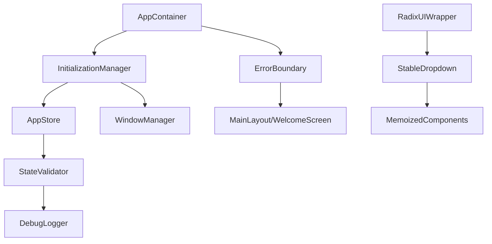

# React无限循环修复设计文档

## 概述

基于对现有代码的分析和控制台日志的研究，React无限循环问题主要源于以下几个方面：

1. **AppContainer组件的useEffect依赖问题**：`useEffect`依赖数组包含了`initializeApp`、`isFirstTime`和`setWelcomeMode`，这些依赖在每次渲染时都可能发生变化
2. **Zustand store状态更新循环**：`initializeApp`函数在执行过程中会更新store状态，触发组件重新渲染，进而再次调用`initializeApp`
3. **Radix UI组件的useEffect依赖缺失**：第三方组件内部的useEffect可能缺少正确的依赖数组
4. **状态管理不当**：多个状态同时更新导致的级联渲染问题

## 架构

### 核心设计原则

1. **单一初始化**：确保应用只初始化一次，使用初始化标志位防止重复调用
2. **依赖稳定化**：使用useCallback和useMemo稳定函数引用，避免不必要的重新渲染
3. **状态批量更新**：合并相关的状态更新，减少渲染次数
4. **错误边界保护**：添加错误边界组件捕获无限循环错误

### 系统架构图



## 组件和接口

### 1. InitializationManager

负责管理应用的初始化流程，确保只初始化一次。

```typescript
interface InitializationManager {
  isInitialized: boolean;
  isInitializing: boolean;
  initializeOnce: () => Promise<void>;
  reset: () => void;
}
```

**职责：**
- 维护初始化状态
- 防止重复初始化
- 提供初始化重置功能（用于测试）

### 2. StableAppContainer

优化后的AppContainer组件，使用稳定的依赖和回调。

```typescript
interface StableAppContainerProps {
  children?: React.ReactNode;
}

interface StableAppContainerState {
  showWelcome: boolean;
  isReady: boolean;
  error: Error | null;
}
```

**优化策略：**
- 使用useCallback稳定函数引用
- 使用useMemo缓存计算结果
- 分离初始化逻辑和渲染逻辑

### 3. StateValidator

验证状态更新的合理性，防止无限循环。

```typescript
interface StateValidator {
  validateStateUpdate: (prevState: any, nextState: any) => boolean;
  detectInfiniteLoop: (updateHistory: StateUpdate[]) => boolean;
  logSuspiciousUpdates: (updates: StateUpdate[]) => void;
}

interface StateUpdate {
  timestamp: number;
  statePath: string;
  prevValue: any;
  nextValue: any;
}
```

### 4. EnhancedErrorBoundary

增强的错误边界组件，专门处理无限循环错误。

```typescript
interface EnhancedErrorBoundaryProps {
  children: React.ReactNode;
  fallback?: React.ComponentType<ErrorFallbackProps>;
  onError?: (error: Error, errorInfo: ErrorInfo) => void;
}

interface ErrorFallbackProps {
  error: Error;
  resetError: () => void;
  isInfiniteLoop: boolean;
}
```

## 数据模型

### 初始化状态模型

```typescript
interface InitializationState {
  status: 'idle' | 'initializing' | 'completed' | 'failed';
  startTime: number | null;
  completedTime: number | null;
  error: Error | null;
  retryCount: number;
}
```

### 状态更新历史模型

```typescript
interface StateUpdateHistory {
  updates: StateUpdate[];
  maxHistorySize: number;
  suspiciousPatterns: SuspiciousPattern[];
}

interface SuspiciousPattern {
  type: 'rapid_updates' | 'circular_dependency' | 'infinite_loop';
  detectedAt: number;
  affectedPaths: string[];
  severity: 'low' | 'medium' | 'high';
}
```

### 优化后的AppStore模型

```typescript
interface OptimizedAppState extends AppState {
  // 添加初始化相关状态
  _initialization: InitializationState;
  _updateHistory: StateUpdateHistory;
  
  // 优化后的actions
  initializeAppOnce: () => Promise<void>;
  batchUpdateState: (updates: Partial<AppState>) => void;
  resetInitialization: () => void;
}
```

## 错误处理

### 错误分类

1. **初始化错误**
   - 重复初始化检测
   - 初始化超时
   - 依赖加载失败

2. **状态更新错误**
   - 无限循环检测
   - 状态验证失败
   - 批量更新冲突

3. **组件渲染错误**
   - useEffect依赖循环
   - 组件挂载/卸载异常
   - 第三方组件错误

### 错误恢复策略

```typescript
interface ErrorRecoveryStrategy {
  detectError: (error: Error) => ErrorType;
  canRecover: (errorType: ErrorType) => boolean;
  recover: (errorType: ErrorType) => Promise<boolean>;
  fallback: (errorType: ErrorType) => React.ReactNode;
}

enum ErrorType {
  INFINITE_LOOP = 'infinite_loop',
  INITIALIZATION_FAILED = 'initialization_failed',
  STATE_CORRUPTION = 'state_corruption',
  COMPONENT_CRASH = 'component_crash'
}
```

## 测试策略

### 单元测试

1. **InitializationManager测试**
   - 单次初始化验证
   - 重复调用防护
   - 错误处理测试

2. **StateValidator测试**
   - 无限循环检测
   - 状态验证逻辑
   - 性能影响测试

3. **StableAppContainer测试**
   - 依赖稳定性验证
   - 渲染次数统计
   - 内存泄漏检测

### 集成测试

1. **完整初始化流程测试**
   - 正常启动流程
   - 异常恢复流程
   - 性能基准测试

2. **状态管理集成测试**
   - 多组件状态同步
   - 批量更新验证
   - 并发更新处理

### 性能测试

1. **渲染性能测试**
   - 组件渲染次数统计
   - 内存使用监控
   - CPU使用率分析

2. **状态更新性能测试**
   - 状态更新延迟测量
   - 批量更新效率
   - 内存占用优化

## 实现细节

### 关键优化点

1. **useEffect依赖优化**
   ```typescript
   // 问题代码
   useEffect(() => {
     init();
   }, [initializeApp, isFirstTime, setWelcomeMode]);
   
   // 优化后
   const stableInit = useCallback(async () => {
     // 初始化逻辑
   }, []); // 空依赖数组
   
   useEffect(() => {
     stableInit();
   }, []); // 只在组件挂载时执行一次
   ```

2. **Zustand store优化**
   ```typescript
   // 添加初始化标志
   const useAppStore = create<AppState>((set, get) => ({
     _isInitialized: false,
     _isInitializing: false,
     
     initializeAppOnce: async () => {
       const { _isInitialized, _isInitializing } = get();
       if (_isInitialized || _isInitializing) return;
       
       set({ _isInitializing: true });
       try {
         // 初始化逻辑
         set({ _isInitialized: true, _isInitializing: false });
       } catch (error) {
         set({ _isInitializing: false });
         throw error;
       }
     }
   }));
   ```

3. **批量状态更新**
   ```typescript
   const batchUpdateState = (updates: Partial<AppState>) => {
     set((state) => ({ ...state, ...updates }));
   };
   ```

### 调试和监控

1. **开发模式调试工具**
   - 状态更新日志
   - 渲染次数统计
   - 性能警告提示

2. **生产模式监控**
   - 错误上报
   - 性能指标收集
   - 用户体验监控

## 迁移计划

### 阶段1：核心修复（高优先级）
- 修复AppContainer的useEffect依赖问题
- 实现InitializationManager
- 添加基础错误边界

### 阶段2：状态管理优化（中优先级）
- 优化Zustand store
- 实现StateValidator
- 添加批量更新机制

### 阶段3：增强功能（低优先级）
- 完善调试工具
- 添加性能监控
- 优化第三方组件集成

### 阶段4：测试和验证
- 完整的测试覆盖
- 性能基准测试
- 用户验收测试