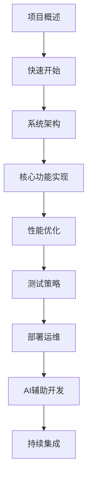

# G-Asset Forge 开发文档 - 桌面应用版

## 🚀 快速开始指南

### 一键初始化桌面应用项目
```bash
# 创建Electron桌面应用
npx create-electron-app g-asset-forge --template=typescript
cd g-asset-forge

# 安装核心依赖
npm install fabric @types/fabric antd zustand
npm install -D electron-builder @types/electron

# 安装前端框架
npm install react react-dom @types/react @types/react-dom
npm install typescript webpack webpack-cli html-webpack-plugin

# 启动开发环境
npm start
```

### 核心技术栈
- **应用框架**: Electron 28+ (跨平台桌面应用)
- **前端**: React 18 + TypeScript
- **画布引擎**: Fabric.js (4106个可复用示例)
- **UI框架**: Ant Design + CSS Modules
- **状态管理**: Zustand
- **文件系统**: Node.js fs + 共享磁盘访问
- **开发周期**: 30天MVP交付

## 📋 项目概述

G-Asset Forge是一个专为内网环境设计的桌面版游戏素材制作工具，采用共享磁盘存储，支持团队协作和素材共享。

### 核心功能模块 (桌面版)
```typescript
interface DesktopModules {
  canvasEditor: "单画板设计系统";
  designTools: "5种基础设计工具";
  imageExport: "高质量图片导出";
  assetManager: "共享磁盘素材库";
  fileSystem: "本地文件操作";
}
```

## 🎯 技术架构 (桌面应用)

### 桌面应用架构
```
┌─────────────────────────────────────┐
│         Electron 主进程             │
│     (文件系统 + 共享磁盘访问)        │
├─────────────────────────────────────┤
│         Electron 渲染进程           │
│    React + Fabric.js + Zustand     │
├─────────────────────────────────────┤
│       Ant Design UI组件层          │
├─────────────────────────────────────┤
│     Node.js API + 原生文件操作      │
└─────────────────────────────────────┘
```

### 核心组件设计 (桌面版)
```typescript
// 桌面应用画布系统
interface DesktopCanvasSystem {
  initCanvas(element: HTMLCanvasElement): void;
  addDesignTool(tool: DesignTool): void;
  exportImage(format: 'png' | 'jpg', quality?: number): Promise<string>;
  saveToSharedDisk(filePath: string): Promise<boolean>;
  loadFromSharedDisk(filePath: string): Promise<boolean>;
}

// 共享磁盘配置
interface SharedDiskConfig {
  basePath: string;          // 共享磁盘根路径
  assetsPath: string;        // 素材库路径
  projectsPath: string;      // 项目文件路径
  exportsPath: string;       // 导出文件路径
  templatesPath: string;     // 模板库路径 (后期)
}

// 设计工具接口
interface DesignTool {
  id: string;
  name: string;
  icon: string;
  activate(): void;
  deactivate(): void;
  onCanvasClick(e: fabric.IEvent): void;
}
```

## 🔧 开发工具配置详解

### 1. 基础开发环境搭建

#### Node.js 环境配置
```bash
# 安装 nvm (Node Version Manager)
curl -o- https://raw.githubusercontent.com/nvm-sh/nvm/v0.39.4/install.sh | bash

# 安装和使用 Node.js 18
nvm install 18.19.0
nvm use 18.19.0
nvm alias default 18.19.0

# 验证安装
node --version  # v18.19.0
npm --version   # 9.2.0

# 配置npm镜像源 (国内用户)
npm config set registry https://registry.npmmirror.com
```

#### 包管理器配置
```bash
# 安装 pnpm (推荐，比 npm 更快)
npm install -g pnpm@latest

# 或使用 yarn
npm install -g yarn@latest

# pnpm 配置
pnpm config set registry https://registry.npmmirror.com
pnpm config set store-dir ~/.pnpm-store
```

#### Git 配置
```bash
# 全局配置
git config --global user.name "Your Name"
git config --global user.email "your.email@example.com"
git config --global init.defaultBranch main
git config --global core.autocrlf input

# 配置 SSH 密钥 (GitHub)
ssh-keygen -t ed25519 -C "your.email@example.com"
```

### 2. VS Code 开发环境配置

#### 必装扩展包
```json
{
  "recommendations": [
    // 核心开发
    "ms-vscode.vscode-typescript-next",
    "bradlc.vscode-tailwindcss",
    "esbenp.prettier-vscode",
    "dbaeumer.vscode-eslint",
    
    // React/前端
    "dsznajder.es7-react-js-snippets",
    "formulahendry.auto-rename-tag",
    "ms-vscode.vscode-json",
    
    // Electron 开发
    "krizzdewizz.electron-builder-vscode",
    "ms-vscode.js-debug",
    
    // Git 协作
    "eamodio.gitlens",
    "github.vscode-pull-request-github",
    
    // AI 助手
    "github.copilot",
    "github.copilot-chat",
    "continue.continue",
    
    // 其他工具
    "ms-vscode.live-server",
    "streetsidesoftware.code-spell-checker",
    "visualstudioexptteam.vscodeintellicode",
    "ms-vscode.vscode-npm-script",
    "christian-kohler.path-intellisense"
  ]
}
```

#### VS Code 设置配置
```json
{
  // .vscode/settings.json
  "editor.formatOnSave": true,
  "editor.formatOnPaste": true,
  "editor.codeActionsOnSave": {
    "source.fixAll.eslint": true,
    "source.organizeImports": true
  },
  "editor.defaultFormatter": "esbenp.prettier-vscode",
  "editor.tabSize": 2,
  "editor.insertSpaces": true,
  "editor.detectIndentation": false,
  
  // TypeScript
  "typescript.preferences.importModuleSpecifier": "relative",
  "typescript.updateImportsOnFileMove.enabled": "always",
  "typescript.suggest.autoImports": true,
  
  // 文件排除
  "files.exclude": {
    "**/node_modules": true,
    "**/dist": true,
    "**/.git": true,
    "**/.DS_Store": true,
    "**/Thumbs.db": true
  },
  
  // 终端配置
  "terminal.integrated.defaultProfile.windows": "PowerShell",
  "terminal.integrated.fontFamily": "Cascadia Code, Consolas, monospace",
  "terminal.integrated.fontSize": 14,
  
  // Electron 调试
  "debug.node.autoAttach": "on",
  
  // 代码片段设置
  "emmet.includeLanguages": {
    "javascript": "javascriptreact",
    "typescript": "typescriptreact"
  }
}
```

#### 调试配置
```json
{
  // .vscode/launch.json
  "version": "0.2.0",
  "configurations": [
    {
      "name": "Electron: Main Process",
      "type": "node",
      "request": "launch",
      "cwd": "${workspaceFolder}",
      "program": "${workspaceFolder}/dist/main/main.js",
      "args": ["--remote-debugging-port=9222"],
      "console": "integratedTerminal",
      "runtimeExecutable": "${workspaceFolder}/node_modules/.bin/electron",
      "windows": {
        "runtimeExecutable": "${workspaceFolder}/node_modules/.bin/electron.cmd"
      },
      "sourceMaps": true,
      "outFiles": ["${workspaceFolder}/dist/**/*.js"],
      "env": {
        "NODE_ENV": "development"
      }
    },
    {
      "name": "Electron: Renderer Process",
      "type": "chrome",
      "request": "attach",
      "port": 9222,
      "timeout": 30000,
      "webRoot": "${workspaceFolder}/src/renderer"
    },
    {
      "name": "Jest Tests",
      "type": "node",
      "request": "launch",
      "program": "${workspaceFolder}/node_modules/.bin/jest",
      "args": ["--runInBand", "--detectOpenHandles"],
      "cwd": "${workspaceFolder}",
      "console": "integratedTerminal",
      "internalConsoleOptions": "neverOpen"
    }
  ],
  "compounds": [
    {
      "name": "Debug Electron App",
      "configurations": ["Electron: Main Process", "Electron: Renderer Process"]
    }
  ]
}
```

### 3. 代码质量工具配置

#### ESLint 配置
```javascript
// .eslintrc.js
module.exports = {
  extends: [
    'eslint:recommended',
    '@typescript-eslint/recommended',
    'plugin:react/recommended',
    'plugin:react-hooks/recommended',
    'plugin:jsx-a11y/recommended',
    'prettier'
  ],
  parser: '@typescript-eslint/parser',
  plugins: ['@typescript-eslint', 'react', 'react-hooks', 'jsx-a11y'],
  parserOptions: {
    ecmaVersion: 2022,
    sourceType: 'module',
    ecmaFeatures: {
      jsx: true
    },
    project: './tsconfig.json'
  },
  settings: {
    react: {
      version: 'detect'
    }
  },
  rules: {
    // TypeScript 规则
    '@typescript-eslint/no-unused-vars': 'error',
    '@typescript-eslint/no-explicit-any': 'warn',
    '@typescript-eslint/explicit-function-return-type': 'off',
    
    // React 规则
    'react/react-in-jsx-scope': 'off',
    'react/prop-types': 'off',
    'react-hooks/rules-of-hooks': 'error',
    'react-hooks/exhaustive-deps': 'warn',
    
    // 通用规则
    'prefer-const': 'error',
    'no-console': process.env.NODE_ENV === 'production' ? 'error' : 'warn',
    'no-debugger': process.env.NODE_ENV === 'production' ? 'error' : 'warn'
  },
  env: {
    browser: true,
    node: true,
    es6: true
  }
};
```

#### Prettier 配置
```json
{
  "printWidth": 80,
  "tabWidth": 2,
  "useTabs": false,
  "semi": true,
  "singleQuote": true,
  "quoteProps": "as-needed",
  "trailingComma": "es5",
  "bracketSpacing": true,
  "bracketSameLine": false,
  "arrowParens": "always",
  "endOfLine": "lf",
  "embeddedLanguageFormatting": "auto"
}
```

#### TypeScript 配置
```json
{
  "compilerOptions": {
    "target": "ES2022",
    "lib": ["DOM", "DOM.Iterable", "ES2022"],
    "allowJs": true,
    "skipLibCheck": true,
    "esModuleInterop": true,
    "allowSyntheticDefaultImports": true,
    "strict": true,
    "forceConsistentCasingInFileNames": true,
    "noFallthroughCasesInSwitch": true,
    "module": "ESNext",
    "moduleResolution": "bundler",
    "resolveJsonModule": true,
    "isolatedModules": true,
    "noEmit": true,
    "jsx": "react-jsx",
    
    // 路径映射
    "baseUrl": ".",
    "paths": {
      "@/*": ["src/*"],
      "@/components/*": ["src/renderer/components/*"],
      "@/stores/*": ["src/renderer/stores/*"],
      "@/utils/*": ["src/renderer/utils/*"],
      "@/types/*": ["src/renderer/types/*"]
    },
    
    // 严格模式选项
    "noUnusedLocals": true,
    "noUnusedParameters": true,
    "noImplicitReturns": true,
    "noUncheckedIndexedAccess": true
  },
  "include": [
    "src/**/*",
    "*.d.ts"
  ],
  "exclude": [
    "node_modules",
    "dist",
    "**/*.test.*",
    "**/*.spec.*"
  ]
}
```

### 4. 构建工具配置

#### Vite 配置 (现代化构建)
```typescript
// vite.config.ts
import { defineConfig } from 'vite';
import react from '@vitejs/plugin-react';
import { resolve } from 'path';

export default defineConfig({
  plugins: [react()],
  
  // 路径别名
  resolve: {
    alias: {
      '@': resolve(__dirname, 'src'),
      '@/components': resolve(__dirname, 'src/renderer/components'),
      '@/stores': resolve(__dirname, 'src/renderer/stores'),
      '@/utils': resolve(__dirname, 'src/renderer/utils'),
      '@/types': resolve(__dirname, 'src/renderer/types'),
    },
  },
  
  // 开发服务器
  server: {
    port: 3000,
    host: true,
    open: true,
  },
  
  // 构建配置
  build: {
    outDir: 'dist/renderer',
    sourcemap: true,
    rollupOptions: {
      input: {
        main: resolve(__dirname, 'src/renderer/index.html'),
      },
    },
  },
  
  // Electron 特殊配置
  base: process.env.ELECTRON === 'true' ? './' : '/',
  
  // 依赖优化
  optimizeDeps: {
    include: ['react', 'react-dom', 'antd', 'fabric'],
  },
});
```

#### Electron Builder 配置
```json
{
  "build": {
    "appId": "com.gassetforge.app",
    "productName": "G-Asset Forge",
    "copyright": "Copyright © 2024 G-Asset Forge",
    "directories": {
      "output": "release",
      "buildResources": "build"
    },
    "files": [
      "dist/**/*",
      "node_modules/**/*",
      "package.json"
    ],
    "extraResources": [
      {
        "from": "assets",
        "to": "assets",
        "filter": ["**/*"]
      }
    ],
    "win": {
      "target": [
        {
          "target": "nsis",
          "arch": ["x64", "ia32"]
        },
        {
          "target": "portable",
          "arch": ["x64"]
        }
      ],
      "icon": "build/icon.ico",
      "requestedExecutionLevel": "asInvoker"
    },
    "mac": {
      "target": [
        {
          "target": "dmg",
          "arch": ["x64", "arm64"]
        }
      ],
      "icon": "build/icon.icns",
      "category": "public.app-category.graphics-design"
    },
    "linux": {
      "target": [
        {
          "target": "AppImage",
          "arch": ["x64"]
        }
      ],
      "icon": "build/icon.png",
      "category": "Graphics"
    },
    "nsis": {
      "oneClick": false,
      "allowToChangeInstallationDirectory": true,
      "createDesktopShortcut": true,
      "createStartMenuShortcut": true
    }
  }
}
```

### 5. 测试环境配置

#### Jest 配置
```javascript
// jest.config.js
module.exports = {
  preset: 'ts-jest',
  testEnvironment: 'jsdom',
  
  // 模块映射
  moduleNameMapping: {
    '^@/(.*)$': '<rootDir>/src/$1',
  },
  
  // 设置文件
  setupFilesAfterEnv: ['<rootDir>/src/test/setupTests.ts'],
  
  // 测试文件匹配
  testMatch: [
    '<rootDir>/src/**/__tests__/**/*.{ts,tsx}',
    '<rootDir>/src/**/*.{test,spec}.{ts,tsx}',
  ],
  
  // 覆盖率配置
  collectCoverageFrom: [
    'src/**/*.{ts,tsx}',
    '!src/**/*.d.ts',
    '!src/test/**/*',
    '!src/**/*.stories.{ts,tsx}',
  ],
  
  // 转换配置
  transform: {
    '^.+\\.tsx?$': 'ts-jest',
    '^.+\\.css$': 'identity-obj-proxy',
  },
  
  // 模块文件扩展名
  moduleFileExtensions: ['ts', 'tsx', 'js', 'jsx', 'json'],
  
  // 忽略的模块
  transformIgnorePatterns: [
    'node_modules/(?!(fabric)/)',
  ],
};
```

#### 测试工具配置
```typescript
// src/test/setupTests.ts
import '@testing-library/jest-dom';

// Mock Electron APIs
const mockElectronAPI = {
  saveProject: jest.fn(),
  loadProject: jest.fn(),
  exportImage: jest.fn(),
  getSharedAssets: jest.fn(),
};

(global as any).electronAPI = mockElectronAPI;

// Mock Canvas API
const mockCanvas = {
  getContext: jest.fn(() => ({
    clearRect: jest.fn(),
    drawImage: jest.fn(),
    getImageData: jest.fn(),
    putImageData: jest.fn(),
  })),
};

(global as any).HTMLCanvasElement = class {
  constructor() {
    return mockCanvas;
  }
};

// Mock Fabric.js
jest.mock('fabric', () => ({
  fabric: {
    Canvas: jest.fn().mockImplementation(() => ({
      add: jest.fn(),
      remove: jest.fn(),
      clear: jest.fn(),
      renderAll: jest.fn(),
      toDataURL: jest.fn(),
      loadFromJSON: jest.fn(),
      toJSON: jest.fn(),
    })),
    Text: jest.fn(),
    Rect: jest.fn(),
    Circle: jest.fn(),
    Image: {
      fromURL: jest.fn(),
    },
  },
}));
```

### 6. 开发脚本配置

#### package.json 脚本
```json
{
  "scripts": {
    "dev": "concurrently \"npm run dev:main\" \"npm run dev:renderer\"",
    "dev:main": "tsc -p tsconfig.main.json && electron dist/main/main.js",
    "dev:renderer": "vite",
    "build": "npm run build:main && npm run build:renderer",
    "build:main": "tsc -p tsconfig.main.json",
    "build:renderer": "vite build",
    "test": "jest",
    "test:watch": "jest --watch",
    "test:coverage": "jest --coverage",
    "lint": "eslint src --ext .ts,.tsx",
    "lint:fix": "eslint src --ext .ts,.tsx --fix",
    "type-check": "tsc --noEmit",
    "format": "prettier --write src",
    "electron": "electron .",
    "electron:dev": "wait-on http://localhost:3000 && electron .",
    "pack": "electron-builder --dir",
    "dist": "electron-builder",
    "dist:win": "electron-builder --win",
    "dist:mac": "electron-builder --mac",
    "dist:linux": "electron-builder --linux",
    "clean": "rimraf dist release",
    "postinstall": "electron-builder install-app-deps"
  }
}
```

### 7. 性能分析工具

#### Bundle 分析器配置
```bash
# 安装分析工具
npm install --save-dev webpack-bundle-analyzer
npm install --save-dev vite-bundle-analyzer

# 分析命令
npm run build && npx vite-bundle-analyzer
```

#### 性能监控集成
```typescript
// src/renderer/utils/performance.ts
export class PerformanceProfiler {
  private static marks: Map<string, number> = new Map();

  static start(label: string) {
    this.marks.set(label, performance.now());
    performance.mark(`${label}-start`);
  }

  static end(label: string) {
    const startTime = this.marks.get(label);
    if (startTime) {
      const duration = performance.now() - startTime;
      performance.mark(`${label}-end`);
      performance.measure(label, `${label}-start`, `${label}-end`);
      
      console.log(`⏱️ ${label}: ${duration.toFixed(2)}ms`);
      return duration;
    }
  }

  static getMetrics() {
    return performance.getEntriesByType('measure');
  }
}
```

### 8. 代码片段和模板

#### React 组件模板
```json
{
  "React Component": {
    "prefix": "rfc",
    "body": [
      "import React from 'react';",
      "",
      "interface ${1:Component}Props {",
      "  $2",
      "}",
      "",
      "export const ${1:Component}: React.FC<${1:Component}Props> = ({",
      "  $3",
      "}) => {",
      "  return (",
      "    <div>",
      "      $4",
      "    </div>",
      "  );",
      "};",
      "",
      "export default ${1:Component};"
    ],
    "description": "Create a React functional component with TypeScript"
  }
}
```

#### 自定义 Hook 模板
```json
{
  "Custom Hook": {
    "prefix": "useHook",
    "body": [
      "import { useState, useEffect } from 'react';",
      "",
      "interface Use${1:Hook}Options {",
      "  $2",
      "}",
      "",
      "export const use${1:Hook} = (options: Use${1:Hook}Options) => {",
      "  const [state, setState] = useState$3();",
      "",
      "  useEffect(() => {",
      "    $4",
      "  }, []);",
      "",
      "  return {",
      "    $5",
      "  };",
      "};"
    ],
    "description": "Create a custom React hook"
  }
}
```

### 9. Git 工作流配置

#### Git Hooks 配置
```bash
# 安装 husky (Git hooks 管理)
npm install --save-dev husky lint-staged

# 初始化 husky
npx husky install

# 添加提交前检查
npx husky add .husky/pre-commit "npx lint-staged"
npx husky add .husky/commit-msg "npx commitlint --edit $1"
```

#### .gitignore 配置
```gitignore
# 依赖
node_modules/
npm-debug.log*
yarn-debug.log*
yarn-error.log*
pnpm-debug.log*
lerna-debug.log*

# 构建输出
dist/
build/
release/

# 运行时文件
*.pid
*.seed
*.pid.lock

# Coverage directory used by tools like istanbul
coverage/
*.lcov

# nyc test coverage
.nyc_output

# ESLint cache
.eslintcache

# Microbundle cache
.rpt2_cache/
.rts2_cache_cjs/
.rts2_cache_es/
.rts2_cache_umd/

# Optional npm cache directory
.npm

# Optional eslint cache
.eslintcache

# Optional stylelint cache
.stylelintcache

# Microbundle cache
.rpt2_cache/
.rts2_cache_cjs/
.rts2_cache_es/
.rts2_cache_umd/

# Optional REPL history
.node_repl_history

# Output of 'npm pack'
*.tgz

# Yarn Integrity file
.yarn-integrity

# dotenv environment variable files
.env
.env.development.local
.env.test.local
.env.production.local
.env.local

# parcel-bundler cache (https://parceljs.org/)
.cache
.parcel-cache

# Next.js build output
.next

# Nuxt.js build / generate output
.nuxt
dist

# Gatsby files
.cache/
public

# vuepress build output
.vuepress/dist

# vuepress v2.x temp and cache directory
.temp
.cache

# Serverless directories
.serverless/

# FuseBox cache
.fusebox/

# DynamoDB Local files
.dynamodb/

# TernJS port file
.tern-port

# Stores VSCode versions used for testing VSCode extensions
.vscode-test

# yarn v2
.yarn/cache
.yarn/unplugged
.yarn/build-state.yml
.yarn/install-state.gz
.pnp.*

# IDE files
.vscode/
.idea/
*.swp
*.swo
*~

# OS generated files
.DS_Store
.DS_Store?
._*
.Spotlight-V100
.Trashes
ehthumbs.db
Thumbs.db

# Electron
app/dist/
release/

# Test files
coverage/
.jest/

# Logs
logs/
*.log

# Shared disk mock (development only)
shared_disk_mock/
```

#### Commit 规范配置
```json
{
  "extends": ["@commitlint/config-conventional"],
  "rules": {
    "type-enum": [
      2,
      "always",
      [
        "feat",
        "fix", 
        "docs",
        "style",
        "refactor",
        "perf",
        "test",
        "chore",
        "build",
        "ci"
      ]
    ],
    "type-case": [2, "always", "lower-case"],
    "type-empty": [2, "never"],
    "subject-empty": [2, "never"],
    "subject-full-stop": [2, "never", "."],
    "subject-case": [2, "always", "lower-case"],
    "header-max-length": [2, "always", 72]
  }
}
```

### 10. 容器化开发环境

#### Dockerfile (开发环境)
```dockerfile
FROM node:18-alpine

WORKDIR /app

# 安装系统依赖
RUN apk add --no-cache \
  git \
  python3 \
  make \
  g++ \
  libx11-dev \
  libxkbfile-dev \
  libsecret-dev

# 复制依赖文件
COPY package*.json ./
COPY pnpm-lock.yaml ./

# 安装 pnpm
RUN npm install -g pnpm

# 安装依赖
RUN pnpm install

# 复制源码
COPY . .

# 开放端口
EXPOSE 3000 9222

# 启动命令
CMD ["pnpm", "dev"]
```

#### Docker Compose 配置
```yaml
version: '3.8'

services:
  app:
    build:
      context: .
      dockerfile: Dockerfile
    ports:
      - "3000:3000"
      - "9222:9222"
    volumes:
      - .:/app
      - /app/node_modules
      - shared_disk:/shared_disk
    environment:
      - NODE_ENV=development
      - SHARED_DISK_PATH=/shared_disk
    command: pnpm dev

  nginx:
    image: nginx:alpine
    ports:
      - "80:80"
    volumes:
      - ./nginx.conf:/etc/nginx/nginx.conf
    depends_on:
      - app

volumes:
  shared_disk:
    driver: local
```

### 11. 自动化工具集成

#### GitHub Actions CI/CD
```yaml
# .github/workflows/ci.yml
name: CI/CD Pipeline

on:
  push:
    branches: [ main, develop ]
  pull_request:
    branches: [ main ]

jobs:
  test:
    runs-on: ubuntu-latest
    
    steps:
    - uses: actions/checkout@v4
    
    - name: Setup Node.js
      uses: actions/setup-node@v4
      with:
        node-version: '18'
        cache: 'pnpm'
    
    - name: Install pnpm
      uses: pnpm/action-setup@v2
      with:
        version: 8
    
    - name: Install dependencies
      run: pnpm install --frozen-lockfile
    
    - name: Type checking
      run: pnpm type-check
    
    - name: Lint
      run: pnpm lint
    
    - name: Test
      run: pnpm test:coverage
    
    - name: Upload coverage to Codecov
      uses: codecov/codecov-action@v3

  build:
    needs: test
    runs-on: ${{ matrix.os }}
    
    strategy:
      matrix:
        os: [ubuntu-latest, windows-latest, macos-latest]
    
    steps:
    - uses: actions/checkout@v4
    
    - name: Setup Node.js
      uses: actions/setup-node@v4
      with:
        node-version: '18'
        cache: 'pnpm'
    
    - name: Install pnpm
      uses: pnpm/action-setup@v2
      with:
        version: 8
    
    - name: Install dependencies
      run: pnpm install --frozen-lockfile
    
    - name: Build application
      run: pnpm build
    
    - name: Build Electron app
      run: pnpm dist
      env:
        GH_TOKEN: ${{ secrets.GITHUB_TOKEN }}
    
    - name: Upload artifacts
      uses: actions/upload-artifact@v3
      with:
        name: dist-${{ matrix.os }}
        path: release/
```

#### 代码质量检查脚本
```bash
#!/bin/bash
# scripts/quality-check.sh

echo "🔍 Running quality checks..."

# 类型检查
echo "📝 Type checking..."
npm run type-check

# 代码规范检查
echo "🔧 Linting..."
npm run lint

# 格式化检查
echo "💅 Format checking..."
npx prettier --check src

# 单元测试
echo "🧪 Running tests..."
npm run test

# 构建检查
echo "🏗️  Build checking..."
npm run build

echo "✅ All quality checks passed!"
```

### 12. 开发效率工具

#### 自动代码生成脚本
```javascript
// scripts/generate-component.js
const fs = require('fs');
const path = require('path');

const generateComponent = (componentName) => {
  const componentDir = path.join(__dirname, `../src/renderer/components/${componentName}`);
  
  // 确保目录存在
  if (!fs.existsSync(componentDir)) {
    fs.mkdirSync(componentDir, { recursive: true });
  }
  
  // 组件文件
  const componentContent = `import React from 'react';
import { ${componentName}Props } from './types';
import styles from './${componentName}.module.css';

export const ${componentName}: React.FC<${componentName}Props> = ({
  children,
  ...props
}) => {
  return (
    <div className={styles.container} {...props}>
      {children}
    </div>
  );
};

export default ${componentName};
`;

  // 类型文件
  const typesContent = `export interface ${componentName}Props {
  children?: React.ReactNode;
  className?: string;
}
`;

  // 样式文件
  const stylesContent = `.container {
  /* Add your styles here */
}
`;

  // 测试文件
  const testContent = `import React from 'react';
import { render, screen } from '@testing-library/react';
import { ${componentName} } from './${componentName}';

describe('${componentName}', () => {
  it('renders correctly', () => {
    render(<${componentName}>Test content</${componentName}>);
    expect(screen.getByText('Test content')).toBeInTheDocument();
  });
});
`;

  // 导出文件
  const indexContent = `export { ${componentName}, default } from './${componentName}';
export type { ${componentName}Props } from './types';
`;

  // 写入文件
  fs.writeFileSync(path.join(componentDir, `${componentName}.tsx`), componentContent);
  fs.writeFileSync(path.join(componentDir, 'types.ts'), typesContent);
  fs.writeFileSync(path.join(componentDir, `${componentName}.module.css`), stylesContent);
  fs.writeFileSync(path.join(componentDir, `${componentName}.test.tsx`), testContent);
  fs.writeFileSync(path.join(componentDir, 'index.ts'), indexContent);

  console.log(`✅ Component ${componentName} generated successfully!`);
};

// 从命令行参数获取组件名
const componentName = process.argv[2];
if (!componentName) {
  console.error('❌ Please provide a component name');
  process.exit(1);
}

generateComponent(componentName);
```

#### 项目健康检查脚本
```javascript
// scripts/health-check.js
const fs = require('fs');
const path = require('path');
const { execSync } = require('child_process');

class ProjectHealthChecker {
  constructor() {
    this.issues = [];
    this.suggestions = [];
  }

  checkDependencies() {
    console.log('🔍 Checking dependencies...');
    
    try {
      const result = execSync('npm outdated --json', { encoding: 'utf8' });
      const outdated = JSON.parse(result);
      
      if (Object.keys(outdated).length > 0) {
        this.issues.push('Some dependencies are outdated');
        this.suggestions.push('Run `npm update` to update dependencies');
      }
    } catch (error) {
      // npm outdated returns non-zero exit code when there are outdated packages
      if (error.stdout) {
        const outdated = JSON.parse(error.stdout);
        if (Object.keys(outdated).length > 0) {
          this.issues.push('Some dependencies are outdated');
          this.suggestions.push('Run `npm update` to update dependencies');
        }
      }
    }
  }

  checkFileStructure() {
    console.log('📁 Checking file structure...');
    
    const requiredFiles = [
      'package.json',
      'tsconfig.json',
      '.eslintrc.js',
      '.prettierrc',
      'src/main/main.ts',
      'src/renderer/index.tsx'
    ];

    for (const file of requiredFiles) {
      if (!fs.existsSync(file)) {
        this.issues.push(`Missing required file: ${file}`);
      }
    }
  }

  checkCodeQuality() {
    console.log('🔧 Checking code quality...');
    
    try {
      execSync('npm run lint', { stdio: 'pipe' });
    } catch (error) {
      this.issues.push('ESLint found issues');
      this.suggestions.push('Run `npm run lint:fix` to fix linting issues');
    }

    try {
      execSync('npm run type-check', { stdio: 'pipe' });
    } catch (error) {
      this.issues.push('TypeScript compilation errors found');
      this.suggestions.push('Fix TypeScript errors before proceeding');
    }
  }

  checkTestCoverage() {
    console.log('🧪 Checking test coverage...');
    
    try {
      const result = execSync('npm run test:coverage -- --passWithNoTests --silent', { encoding: 'utf8' });
      
      // 简单的覆盖率解析
      const coverageMatch = result.match(/All files\s+\|\s+([\d.]+)/);
      if (coverageMatch) {
        const coverage = parseFloat(coverageMatch[1]);
        if (coverage < 70) {
          this.issues.push(`Low test coverage: ${coverage}%`);
          this.suggestions.push('Add more tests to improve coverage');
        }
      }
    } catch (error) {
      this.issues.push('Test execution failed');
      this.suggestions.push('Fix failing tests');
    }
  }

  generateReport() {
    console.log('\n📊 Health Check Report');
    console.log('='.repeat(50));
    
    if (this.issues.length === 0) {
      console.log('✅ Project health is excellent!');
      return;
    }

    console.log(`❌ Found ${this.issues.length} issue(s):`);
    this.issues.forEach((issue, index) => {
      console.log(`${index + 1}. ${issue}`);
    });

    console.log('\n💡 Suggestions:');
    this.suggestions.forEach((suggestion, index) => {
      console.log(`${index + 1}. ${suggestion}`);
    });

    console.log('\n📈 Project Health Score:', this.calculateHealthScore());
  }

  calculateHealthScore() {
    const maxScore = 100;
    const penalty = this.issues.length * 10;
    const score = Math.max(0, maxScore - penalty);
    
    if (score >= 90) return `${score}/100 (Excellent) ✅`;
    if (score >= 70) return `${score}/100 (Good) 👍`;
    if (score >= 50) return `${score}/100 (Fair) ⚠️`;
    return `${score}/100 (Poor) ❌`;
  }

  run() {
    console.log('🏥 Starting project health check...\n');
    
    this.checkDependencies();
    this.checkFileStructure();
    this.checkCodeQuality();
    this.checkTestCoverage();
    
    this.generateReport();
  }
}

const checker = new ProjectHealthChecker();
checker.run();
```

### 13. AI 辅助开发配置

#### Cursor AI 配置
```json
{
  "rules": [
    {
      "pattern": "**/*.{ts,tsx}",
      "assistant": "typescript-react",
      "instructions": [
        "Always use TypeScript with strict typing",
        "Prefer functional components with hooks",
        "Use proper error handling",
        "Include JSDoc comments for complex functions",
        "Follow React best practices"
      ]
    },
    {
      "pattern": "**/components/**",
      "assistant": "react-component",
      "instructions": [
        "Create reusable components",
        "Use proper prop types",
        "Include accessibility attributes",
        "Add appropriate CSS classes"
      ]
    }
  ],
  "codeGeneration": {
    "style": "modern",
    "framework": "react",
    "language": "typescript"
  }
}
```

#### GitHub Copilot 配置
```json
{
  "github.copilot.enable": {
    "*": true,
    "yaml": false,
    "plaintext": false
  },
  "github.copilot.inlineSuggest.enable": true,
  "github.copilot.suggestions.enabled": true
}
```

### 桌面应用项目结构
```
g-asset-forge/
├── src/
│   ├── main/              # Electron主进程
│   │   ├── main.ts       # 应用入口
│   │   └── fileSystem.ts # 共享磁盘操作
│   ├── renderer/          # Electron渲染进程
│   │   ├── components/   # React组件
│   │   │   ├── canvas/   # 画布系统
│   │   │   ├── tools/    # 设计工具
│   │   │   └── ui/       # 通用UI组件
│   │   ├── stores/       # Zustand状态管理
│   │   ├── utils/        # 工具函数
│   │   └── types/        # TypeScript类型
│   └── shared/           # 主进程和渲染进程共享代码
├── assets/               # 应用资源文件
├── dist/                 # 构建输出目录
└── shared_disk_mock/     # 开发环境模拟共享磁盘
```

## 💻 核心模块实现 (桌面应用版)

### 1. Electron主进程 - 文件系统管理
```typescript
// src/main/main.ts
import { app, BrowserWindow, ipcMain, dialog } from 'electron';
import * as path from 'path';
import * as fs from 'fs/promises';

interface SharedDiskManager {
  basePath: string;
  assetsPath: string;
  projectsPath: string;
  exportsPath: string;
}

class ElectronMain {
  private mainWindow: BrowserWindow | null = null;
  private sharedDisk: SharedDiskManager;

  constructor() {
    this.sharedDisk = this.initSharedDisk();
    this.setupIPCHandlers();
  }

  private initSharedDisk(): SharedDiskManager {
    // 开发环境使用本地模拟，生产环境使用实际共享磁盘
    const basePath = process.env.NODE_ENV === 'development' 
      ? path.join(__dirname, '../shared_disk_mock')
      : 'Z:\\GAF_SharedDisk'; // 实际共享磁盘路径

    return {
      basePath,
      assetsPath: path.join(basePath, 'assets'),
      projectsPath: path.join(basePath, 'projects'),
      exportsPath: path.join(basePath, 'exports'),
    };
  }

  private setupIPCHandlers() {
    // 项目保存
    ipcMain.handle('save-project', async (event, projectData, fileName) => {
      try {
        const filePath = path.join(this.sharedDisk.projectsPath, fileName);
        await fs.writeFile(filePath, JSON.stringify(projectData, null, 2));
        return { success: true, path: filePath };
      } catch (error) {
        return { success: false, error: error.message };
      }
    });

    // 项目加载
    ipcMain.handle('load-project', async (event, fileName) => {
      try {
        const filePath = path.join(this.sharedDisk.projectsPath, fileName);
        const data = await fs.readFile(filePath, 'utf-8');
        return { success: true, data: JSON.parse(data) };
      } catch (error) {
        return { success: false, error: error.message };
      }
    });

    // 图片导出到共享磁盘
    ipcMain.handle('export-image', async (event, imageData, fileName) => {
      try {
        const buffer = Buffer.from(imageData.split(',')[1], 'base64');
        const filePath = path.join(this.sharedDisk.exportsPath, fileName);
        await fs.writeFile(filePath, buffer);
        return { success: true, path: filePath };
      } catch (error) {
        return { success: false, error: error.message };
      }
    });

    // 获取共享素材列表
    ipcMain.handle('get-shared-assets', async () => {
      try {
        const files = await fs.readdir(this.sharedDisk.assetsPath);
        const assets = files
          .filter(file => /\.(jpg|jpeg|png|gif|svg)$/i.test(file))
          .map(file => ({
            name: file,
            path: path.join(this.sharedDisk.assetsPath, file),
            url: `file://${path.join(this.sharedDisk.assetsPath, file)}`
          }));
        return { success: true, assets };
      } catch (error) {
        return { success: false, error: error.message };
      }
    });
  }

  async createWindow() {
    this.mainWindow = new BrowserWindow({
      width: 1400,
      height: 900,
      minWidth: 1200,
      minHeight: 800,
      webPreferences: {
        nodeIntegration: false,
        contextIsolation: true,
        preload: path.join(__dirname, 'preload.js')
      }
    });

    await this.mainWindow.loadFile('dist/index.html');
    
    // 开发环境启用DevTools
    if (process.env.NODE_ENV === 'development') {
      this.mainWindow.webContents.openDevTools();
    }
  }
}

new ElectronMain().createWindow();
```

### 2. 画布系统 (桌面版)
```typescript
// src/renderer/stores/canvasStore.ts
import { create } from 'zustand';
import { fabric } from 'fabric';
import { DesignTool } from '../types/tools';

interface DesktopCanvasStore {
  canvas: fabric.Canvas | null;
  activeTool: string | null;
  tools: DesignTool[];
  projectName: string;
  isDirty: boolean; // 是否有未保存的更改
  
  // 画布操作
  initCanvas: (element: HTMLCanvasElement) => void;
  setActiveTool: (toolId: string) => void;
  addObject: (object: fabric.Object) => void;
  
  // 文件操作 (通过IPC)
  saveProject: () => Promise<boolean>;
  loadProject: (fileName: string) => Promise<boolean>;
  exportImage: (format: 'png' | 'jpg', quality?: number) => Promise<string>;
  
  // 5种基础设计工具
  addText: (text: string) => void;
  addRectangle: () => void;
  addCircle: () => void;
  addImage: (imageUrl: string) => void;
  selectMode: () => void;
}

export const useCanvasStore = create<DesktopCanvasStore>((set, get) => ({
  canvas: null,
  activeTool: 'select',
  tools: [
    { id: 'select', name: '选择', icon: 'cursor' },
    { id: 'text', name: '文字', icon: 'type' },
    { id: 'rectangle', name: '矩形', icon: 'square' },
    { id: 'circle', name: '圆形', icon: 'circle' },
    { id: 'image', name: '图片', icon: 'image' },
  ],
  projectName: '未命名项目',
  isDirty: false,
  
  initCanvas: (element) => {
    const canvas = new fabric.Canvas(element, {
      width: 800,
      height: 600,
      backgroundColor: '#ffffff',
    });
    
    // 监听画布变化
    canvas.on('object:added', () => set({ isDirty: true }));
    canvas.on('object:modified', () => set({ isDirty: true }));
    canvas.on('object:removed', () => set({ isDirty: true }));
    
    set({ canvas });
  },
  
  setActiveTool: (toolId) => {
    const { canvas } = get();
    if (!canvas) return;
    
    canvas.isDrawingMode = false;
    canvas.selection = toolId === 'select';
    
    set({ activeTool: toolId });
  },
  
  addObject: (object) => {
    const { canvas } = get();
    if (!canvas) return;
    
    canvas.add(object);
    canvas.setActiveObject(object);
    canvas.renderAll();
  },
  
  // 5种基础设计工具实现
  addText: (text = '输入文字') => {
    const { addObject } = get();
    const textObj = new fabric.Text(text, {
      left: 100,
      top: 100,
      fontFamily: 'Microsoft YaHei',
      fontSize: 24,
      fill: '#000000'
    });
    addObject(textObj);
  },
  
  addRectangle: () => {
    const { addObject } = get();
    const rect = new fabric.Rect({
      left: 100,
      top: 100,
      width: 200,
      height: 100,
      fill: '#3498db',
      stroke: '#2980b9',
      strokeWidth: 2
    });
    addObject(rect);
  },
  
  addCircle: () => {
    const { addObject } = get();
    const circle = new fabric.Circle({
      left: 100,
      top: 100,
      radius: 50,
      fill: '#e74c3c',
      stroke: '#c0392b',
      strokeWidth: 2
    });
    addObject(circle);
  },
  
  addImage: (imageUrl) => {
    const { addObject } = get();
    fabric.Image.fromURL(imageUrl, (img) => {
      img.set({
        left: 100,
        top: 100,
        scaleX: 0.5,
        scaleY: 0.5
      });
      addObject(img);
    });
  },
  
  selectMode: () => {
    get().setActiveTool('select');
  },
  
  // 文件操作
  saveProject: async () => {
    const { canvas, projectName } = get();
    if (!canvas) return false;
    
    try {
      const canvasData = canvas.toJSON();
      const projectData = {
        name: projectName,
        canvas: canvasData,
        timestamp: Date.now(),
        version: '1.0'
      };
      
      const result = await window.electronAPI.saveProject(
        projectData, 
        `${projectName}.json`
      );
      
      if (result.success) {
        set({ isDirty: false });
        return true;
      }
      
      return false;
    } catch (error) {
      console.error('保存项目失败:', error);
      return false;
    }
  },
  
  loadProject: async (fileName) => {
    const { canvas } = get();
    if (!canvas) return false;
    
    try {
      const result = await window.electronAPI.loadProject(fileName);
      
      if (result.success) {
        await new Promise<void>((resolve) => {
          canvas.loadFromJSON(result.data.canvas, () => {
            canvas.renderAll();
            resolve();
          });
        });
        
        set({ 
          projectName: result.data.name,
          isDirty: false 
        });
        
        return true;
      }
      
      return false;
    } catch (error) {
      console.error('加载项目失败:', error);
      return false;
    }
  },
  
  exportImage: async (format = 'png', quality = 1.0) => {
    const { canvas, projectName } = get();
    if (!canvas) return '';
    
    try {
      const dataURL = canvas.toDataURL({
        format: `image/${format}`,
        quality: quality,
        multiplier: 2 // 高清导出
      });
      
      const fileName = `${projectName}_${Date.now()}.${format}`;
      const result = await window.electronAPI.exportImage(dataURL, fileName);
      
      return result.success ? result.path : '';
    } catch (error) {
      console.error('导出图片失败:', error);
      return '';
    }
  },
}));
```

### 3. 共享素材管理器
```typescript
// src/renderer/stores/assetStore.ts
import { create } from 'zustand';

interface Asset {
  name: string;
  path: string;
  url: string;
  type: 'image' | 'template';
  size?: number;
  dimensions?: { width: number; height: number };
}

interface AssetStore {
  assets: Asset[];
  loading: boolean;
  
  loadSharedAssets: () => Promise<void>;
  uploadAsset: (file: File) => Promise<boolean>;
  deleteAsset: (assetName: string) => Promise<boolean>;
}

export const useAssetStore = create<AssetStore>((set, get) => ({
  assets: [],
  loading: false,
  
  loadSharedAssets: async () => {
    set({ loading: true });
    try {
      const result = await window.electronAPI.getSharedAssets();
      if (result.success) {
        set({ assets: result.assets });
      }
    } catch (error) {
      console.error('加载共享素材失败:', error);
    } finally {
      set({ loading: false });
    }
  },
  
  uploadAsset: async (file) => {
    try {
      const buffer = await file.arrayBuffer();
      const result = await window.electronAPI.uploadAsset(
        Array.from(new Uint8Array(buffer)), 
        file.name
      );
      
      if (result.success) {
        get().loadSharedAssets(); // 重新加载素材列表
        return true;
      }
      
      return false;
    } catch (error) {
      console.error('上传素材失败:', error);
      return false;
    }
  },
  
  deleteAsset: async (assetName) => {
    try {
      const result = await window.electronAPI.deleteAsset(assetName);
      if (result.success) {
        get().loadSharedAssets(); // 重新加载素材列表
        return true;
      }
      return false;
    } catch (error) {
      console.error('删除素材失败:', error);
      return false;
    }
  },
}));
```

## 🎨 UI组件库 (桌面应用版)

### 1. 桌面版工具栏组件
```tsx
// src/renderer/components/ToolBar.tsx
import React from 'react';
import { Button, Space, Tooltip, Typography } from 'antd';
import { 
  SelectOutlined, 
  FontSizeOutlined, 
  BorderOutlined, 
  BorderlessTableOutlined,
  PictureOutlined,
  SaveOutlined,
  FolderOpenOutlined,
  ExportOutlined 
} from '@ant-design/icons';
import { useCanvasStore } from '../stores/canvasStore';

const { Text } = Typography;

export const DesktopToolBar: React.FC = () => {
  const { 
    activeTool, 
    setActiveTool, 
    addText, 
    addRectangle, 
    addCircle,
    saveProject,
    exportImage,
    isDirty,
    projectName 
  } = useCanvasStore();
  
  const handleToolClick = (toolId: string) => {
    setActiveTool(toolId);
    
    // 快速添加对象
    switch (toolId) {
      case 'text':
        addText('输入文字');
        break;
      case 'rectangle':
        addRectangle();
        break;
      case 'circle':
        addCircle();
        break;
    }
  };

  return (
    <div className="desktop-toolbar">
      {/* 项目信息 */}
      <div className="project-info">
        <Text strong>{projectName}</Text>
        {isDirty && <Text type="warning"> *</Text>}
      </div>
      
      {/* 设计工具 */}
      <Space.Compact size="middle">
        <Tooltip title="选择工具 (V)">
          <Button 
            icon={<SelectOutlined />}
            type={activeTool === 'select' ? 'primary' : 'default'}
            onClick={() => setActiveTool('select')}
          />
        </Tooltip>
        
        <Tooltip title="添加文字 (T)">
          <Button 
            icon={<FontSizeOutlined />}
            type={activeTool === 'text' ? 'primary' : 'default'}
            onClick={() => handleToolClick('text')}
          />
        </Tooltip>
        
        <Tooltip title="添加矩形 (R)">
          <Button 
            icon={<BorderOutlined />}
            type={activeTool === 'rectangle' ? 'primary' : 'default'}
            onClick={() => handleToolClick('rectangle')}
          />
        </Tooltip>
        
        <Tooltip title="添加圆形 (C)">
          <Button 
            icon={<BorderlessTableOutlined />}
            type={activeTool === 'circle' ? 'primary' : 'default'}
            onClick={() => handleToolClick('circle')}
          />
        </Tooltip>
        
        <Tooltip title="添加图片 (I)">
          <Button 
            icon={<PictureOutlined />}
            type={activeTool === 'image' ? 'primary' : 'default'}
            onClick={() => setActiveTool('image')}
          />
        </Tooltip>
      </Space.Compact>
      
      {/* 文件操作 */}
      <Space>
        <Tooltip title="保存到共享磁盘 (Ctrl+S)">
          <Button 
            icon={<SaveOutlined />}
            onClick={saveProject}
            type={isDirty ? 'primary' : 'default'}
          >
            保存
          </Button>
        </Tooltip>
        
        <Tooltip title="从共享磁盘加载">
          <Button icon={<FolderOpenOutlined />}>
            打开
          </Button>
        </Tooltip>
        
        <Tooltip title="导出图片">
          <Button 
            icon={<ExportOutlined />}
            onClick={() => exportImage('png')}
          >
            导出
          </Button>
        </Tooltip>
      </Space>
    </div>
  );
};
```

### 2. 共享素材面板
```tsx
// src/renderer/components/SharedAssetPanel.tsx
import React, { useEffect } from 'react';
import { Card, List, Image, Button, Upload, message, Spin } from 'antd';
import { InboxOutlined, DeleteOutlined } from '@ant-design/icons';
import { useAssetStore } from '../stores/assetStore';
import { useCanvasStore } from '../stores/canvasStore';

const { Dragger } = Upload;

export const SharedAssetPanel: React.FC = () => {
  const { assets, loading, loadSharedAssets, uploadAsset, deleteAsset } = useAssetStore();
  const { addImage } = useCanvasStore();

  useEffect(() => {
    loadSharedAssets();
  }, []);

  const handleUpload = async (file: File) => {
    const success = await uploadAsset(file);
    if (success) {
      message.success('素材上传成功');
    } else {
      message.error('素材上传失败');
    }
    return false; // 阻止默认上传行为
  };

  const handleDelete = async (assetName: string) => {
    const success = await deleteAsset(assetName);
    if (success) {
      message.success('素材删除成功');
    } else {
      message.error('素材删除失败');
    }
  };

  const handleUseAsset = (asset: any) => {
    addImage(asset.url);
    message.success('素材已添加到画布');
  };

  return (
    <Card title="共享素材库" className="shared-asset-panel">
      {/* 上传区域 */}
      <Dragger
        name="file"
        multiple={false}
        accept="image/*"
        beforeUpload={handleUpload}
        showUploadList={false}
        style={{ marginBottom: 16 }}
      >
        <p className="ant-upload-drag-icon">
          <InboxOutlined />
        </p>
        <p className="ant-upload-text">点击或拖拽文件到此区域上传</p>
        <p className="ant-upload-hint">
          支持 JPG、PNG、GIF、SVG 格式
        </p>
      </Dragger>

      {/* 素材列表 */}
      <Spin spinning={loading}>
        <List
          grid={{ gutter: 16, column: 3 }}
          dataSource={assets}
          renderItem={(asset) => (
            <List.Item>
              <Card
                hoverable
                size="small"
                cover={
                  <Image
                    src={asset.url}
                    alt={asset.name}
                    height={100}
                    style={{ objectFit: 'cover' }}
                    onClick={() => handleUseAsset(asset)}
                  />
                }
                actions={[
                  <Button 
                    type="text" 
                    size="small"
                    onClick={() => handleUseAsset(asset)}
                  >
                    使用
                  </Button>,
                  <Button 
                    type="text" 
                    danger 
                    size="small"
                    icon={<DeleteOutlined />}
                    onClick={() => handleDelete(asset.name)}
                  />
                ]}
              >
                <Card.Meta 
                  title={asset.name}
                  description={`${asset.dimensions?.width || 0}×${asset.dimensions?.height || 0}`}
                />
              </Card>
            </List.Item>
          )}
        />
      </Spin>
    </Card>
  );
};
```

### 3. 主应用布局 (桌面版)
```tsx
// src/renderer/components/DesktopApp.tsx
import React, { useRef, useEffect } from 'react';
import { Layout, Splitter } from 'antd';
import { DesktopToolBar } from './ToolBar';
import { SharedAssetPanel } from './SharedAssetPanel';
import { PropertyPanel } from './PropertyPanel';
import { useCanvasStore } from '../stores/canvasStore';
import './DesktopApp.css';

const { Header, Content, Sider } = Layout;

export const DesktopApp: React.FC = () => {
  const canvasRef = useRef<HTMLCanvasElement>(null);
  const { initCanvas } = useCanvasStore();

  useEffect(() => {
    if (canvasRef.current) {
      initCanvas(canvasRef.current);
    }
  }, []);

  // 监听快捷键
  useEffect(() => {
    const handleKeyDown = (e: KeyboardEvent) => {
      if (e.ctrlKey) {
        switch (e.key) {
          case 's':
            e.preventDefault();
            useCanvasStore.getState().saveProject();
            break;
          case 'o':
            e.preventDefault();
            // 触发打开文件对话框
            break;
          case 'e':
            e.preventDefault();
            useCanvasStore.getState().exportImage('png');
            break;
        }
      }
    };

    window.addEventListener('keydown', handleKeyDown);
    return () => window.removeEventListener('keydown', handleKeyDown);
  }, []);

  return (
    <Layout className="desktop-app">
      {/* 顶部工具栏 */}
      <Header className="app-header">
        <DesktopToolBar />
      </Header>
      
      {/* 主内容区 */}
      <Layout>
        <Splitter>
          {/* 左侧面板 - 共享素材 */}
          <Splitter.Panel defaultSize="20%" min="200px" max="400px">
            <Sider width="100%" theme="light" className="left-panel">
              <SharedAssetPanel />
            </Sider>
          </Splitter.Panel>
          
          {/* 中间画布区域 */}
          <Splitter.Panel>
            <Content className="canvas-container">
              <div className="canvas-wrapper">
                <canvas ref={canvasRef} className="main-canvas" />
              </div>
            </Content>
          </Splitter.Panel>
          
          {/* 右侧属性面板 */}
          <Splitter.Panel defaultSize="20%" min="200px" max="400px">
            <Sider width="100%" theme="light" className="right-panel">
              <PropertyPanel />
            </Sider>
          </Splitter.Panel>
        </Splitter>
      </Layout>
    </Layout>
  );
};
```

## 📊 性能优化

### 1. 渲染引擎优化

#### 脏矩形渲染系统
```tsx
// src/renderer/core/DirtyRectRenderer.ts
export class DirtyRectRenderer {
  private dirtyRects: Set<Rectangle> = new Set();
  private canvas: HTMLCanvasElement;
  private ctx: CanvasRenderingContext2D;

  constructor(canvas: HTMLCanvasElement) {
    this.canvas = canvas;
    this.ctx = canvas.getContext('2d')!;
  }

  // 标记脏区域
  markDirty(rect: Rectangle) {
    this.dirtyRects.add(rect);
  }

  // 合并相邻的脏矩形
  private mergeDirtyRects(): Rectangle[] {
    const rects = Array.from(this.dirtyRects);
    const merged: Rectangle[] = [];

    for (const rect of rects) {
      let wasMerged = false;
      for (const existingRect of merged) {
        if (this.canMerge(rect, existingRect)) {
          this.mergeRects(existingRect, rect);
          wasMerged = true;
          break;
        }
      }
      if (!wasMerged) {
        merged.push({ ...rect });
      }
    }

    return merged;
  }

  // 执行局部渲染
  render(objects: CanvasObject[]) {
    const mergedRects = this.mergeDirtyRects();
    
    for (const rect of mergedRects) {
      // 清空脏区域
      this.ctx.clearRect(rect.x, rect.y, rect.width, rect.height);
      
      // 重绘该区域内的对象
      const intersectingObjects = objects.filter(obj => 
        this.intersects(obj.bounds, rect)
      );
      
      for (const obj of intersectingObjects) {
        obj.render(this.ctx, rect);
      }
    }
    
    this.dirtyRects.clear();
  }
}
```

#### 虚拟化渲染 (大量对象场景)
```tsx
// src/renderer/core/VirtualRenderer.ts
export class VirtualRenderer {
  private viewportBounds: Rectangle;
  private renderBuffer: number = 100; // 缓冲区大小

  constructor(private canvas: HTMLCanvasElement) {
    this.updateViewport();
  }

  updateViewport() {
    const rect = this.canvas.getBoundingClientRect();
    this.viewportBounds = {
      x: 0,
      y: 0,
      width: rect.width,
      height: rect.height
    };
  }

  // 只渲染视窗内及缓冲区的对象
  getVisibleObjects(objects: CanvasObject[]): CanvasObject[] {
    const expandedViewport = {
      x: this.viewportBounds.x - this.renderBuffer,
      y: this.viewportBounds.y - this.renderBuffer,
      width: this.viewportBounds.width + this.renderBuffer * 2,
      height: this.viewportBounds.height + this.renderBuffer * 2
    };

    return objects.filter(obj => 
      this.intersects(obj.bounds, expandedViewport)
    );
  }
}
```

### 2. 内存管理优化

#### 对象池模式
```tsx
// src/renderer/core/ObjectPool.ts
export class ObjectPool<T> {
  private pool: T[] = [];
  private createFn: () => T;
  private resetFn: (obj: T) => void;

  constructor(createFn: () => T, resetFn: (obj: T) => void, initialSize = 10) {
    this.createFn = createFn;
    this.resetFn = resetFn;
    
    // 预创建对象
    for (let i = 0; i < initialSize; i++) {
      this.pool.push(createFn());
    }
  }

  acquire(): T {
    if (this.pool.length > 0) {
      return this.pool.pop()!;
    }
    return this.createFn();
  }

  release(obj: T) {
    this.resetFn(obj);
    this.pool.push(obj);
  }
}

// 使用示例
const rectanglePool = new ObjectPool<Rectangle>(
  () => ({ x: 0, y: 0, width: 0, height: 0 }),
  (rect) => { rect.x = rect.y = rect.width = rect.height = 0; }
);
```

#### 纹理缓存管理
```tsx
// src/renderer/core/TextureCache.ts
export class TextureCache {
  private static instance: TextureCache;
  private cache = new Map<string, ImageBitmap>();
  private maxCacheSize = 100 * 1024 * 1024; // 100MB
  private currentCacheSize = 0;

  static getInstance(): TextureCache {
    if (!TextureCache.instance) {
      TextureCache.instance = new TextureCache();
    }
    return TextureCache.instance;
  }

  async loadTexture(url: string): Promise<ImageBitmap> {
    if (this.cache.has(url)) {
      return this.cache.get(url)!;
    }

    try {
      const response = await fetch(url);
      const blob = await response.blob();
      const bitmap = await createImageBitmap(blob);
      
      // 检查缓存大小
      const textureSize = bitmap.width * bitmap.height * 4; // RGBA
      if (this.currentCacheSize + textureSize > this.maxCacheSize) {
        this.evictLRU();
      }
      
      this.cache.set(url, bitmap);
      this.currentCacheSize += textureSize;
      
      return bitmap;
    } catch (error) {
      console.error('Failed to load texture:', url, error);
      throw error;
    }
  }

  private evictLRU() {
    // 简单的LRU淘汰策略
    const firstKey = this.cache.keys().next().value;
    if (firstKey) {
      const bitmap = this.cache.get(firstKey)!;
      const textureSize = bitmap.width * bitmap.height * 4;
      this.cache.delete(firstKey);
      this.currentCacheSize -= textureSize;
      bitmap.close(); // 释放GPU内存
    }
  }
}
```

### 3. 操作性能优化

#### 防抖动优化
```tsx
// src/renderer/hooks/useDebounce.ts
import { useCallback, useRef } from 'react';

export function useDebounce<T extends (...args: any[]) => any>(
  fn: T,
  delay: number
): T {
  const timeoutRef = useRef<NodeJS.Timeout>();

  return useCallback(
    (...args: Parameters<T>) => {
      if (timeoutRef.current) {
        clearTimeout(timeoutRef.current);
      }
      
      timeoutRef.current = setTimeout(() => {
        fn(...args);
      }, delay);
    },
    [fn, delay]
  ) as T;
}

// 在画布操作中使用
const debouncedSave = useDebounce(() => {
  saveProject();
}, 2000); // 2秒后自动保存
```

#### 批量操作优化
```tsx
// src/renderer/core/BatchProcessor.ts
export class BatchProcessor {
  private operations: (() => void)[] = [];
  private isProcessing = false;

  add(operation: () => void) {
    this.operations.push(operation);
    if (!this.isProcessing) {
      this.processBatch();
    }
  }

  private async processBatch() {
    this.isProcessing = true;
    
    // 使用 requestAnimationFrame 确保在合适的时机执行
    await new Promise(resolve => requestAnimationFrame(resolve));
    
    const batchSize = Math.min(this.operations.length, 50); // 每批次最多50个操作
    const currentBatch = this.operations.splice(0, batchSize);
    
    for (const operation of currentBatch) {
      operation();
    }
    
    if (this.operations.length > 0) {
      // 还有未处理的操作，继续处理
      this.processBatch();
    } else {
      this.isProcessing = false;
    }
  }
}
```
### 4. 高级缓存策略

#### 多层缓存架构
```tsx
// src/renderer/core/MultiLevelCache.ts
export class MultiLevelCache {
  private memoryCache = new Map<string, any>();
  private diskCache: IDBObjectStore | null = null;
  private maxMemorySize = 50 * 1024 * 1024; // 50MB内存缓存
  private currentMemorySize = 0;

  async init() {
    const db = await this.openDB();
    const transaction = db.transaction(['cache'], 'readwrite');
    this.diskCache = transaction.objectStore('cache');
  }

  private openDB(): Promise<IDBDatabase> {
    return new Promise((resolve, reject) => {
      const request = indexedDB.open('AssetCache', 1);
      
      request.onerror = () => reject(request.error);
      request.onsuccess = () => resolve(request.result);
      
      request.onupgradeneeded = (event) => {
        const db = (event.target as IDBOpenDBRequest).result;
        if (!db.objectStoreNames.contains('cache')) {
          const store = db.createObjectStore('cache', { keyPath: 'id' });
          store.createIndex('timestamp', 'timestamp');
        }
      };
    });
  }

  async get<T>(key: string): Promise<T | null> {
    // 1. 先查内存缓存
    if (this.memoryCache.has(key)) {
      return this.memoryCache.get(key);
    }

    // 2. 查磁盘缓存
    if (this.diskCache) {
      const request = this.diskCache.get(key);
      const result = await new Promise(resolve => {
        request.onsuccess = () => resolve(request.result);
        request.onerror = () => resolve(null);
      });

      if (result) {
        // 提升到内存缓存
        this.setMemoryCache(key, (result as any).data);
        return (result as any).data;
      }
    }

    return null;
  }

  async set<T>(key: string, data: T, ttl: number = 3600000): Promise<void> {
    const cacheItem = {
      id: key,
      data,
      timestamp: Date.now(),
      ttl
    };

    // 设置内存缓存
    this.setMemoryCache(key, data);

    // 设置磁盘缓存
    if (this.diskCache) {
      this.diskCache.put(cacheItem);
    }
  }

  private setMemoryCache(key: string, data: any) {
    const size = this.estimateSize(data);
    
    // 内存溢出检查
    while (this.currentMemorySize + size > this.maxMemorySize && this.memoryCache.size > 0) {
      const firstKey = this.memoryCache.keys().next().value;
      const firstData = this.memoryCache.get(firstKey);
      this.memoryCache.delete(firstKey);
      this.currentMemorySize -= this.estimateSize(firstData);
    }

    this.memoryCache.set(key, data);
    this.currentMemorySize += size;
  }

  private estimateSize(data: any): number {
    return JSON.stringify(data).length * 2; // 粗略估算
  }
}
```

#### 预加载策略
```tsx
// src/renderer/core/AssetPreloader.ts
export class AssetPreloader {
  private loadQueue: string[] = [];
  private loading = new Set<string>();
  private loaded = new Set<string>();
  private maxConcurrent = 3;

  // 智能预加载 - 根据用户行为预测
  async preloadByPattern(userBehavior: UserAction[]) {
    const patterns = this.analyzePatterns(userBehavior);
    
    for (const pattern of patterns) {
      const likelyAssets = this.predictAssets(pattern);
      for (const asset of likelyAssets) {
        if (!this.loaded.has(asset) && !this.loading.has(asset)) {
          this.loadQueue.push(asset);
        }
      }
    }
    
    this.processQueue();
  }

  // 可视区域预加载
  async preloadVisibleArea(viewport: Rectangle, allAssets: AssetInfo[]) {
    const expandedViewport = this.expandViewport(viewport, 1.5); // 扩展50%
    
    const visibleAssets = allAssets
      .filter(asset => this.isIntersecting(asset.bounds, expandedViewport))
      .map(asset => asset.url);
    
    for (const url of visibleAssets) {
      if (!this.loaded.has(url)) {
        this.loadQueue.unshift(url); // 优先加载可视区域
      }
    }
    
    this.processQueue();
  }

  private async processQueue() {
    while (this.loadQueue.length > 0 && this.loading.size < this.maxConcurrent) {
      const url = this.loadQueue.shift()!;
      this.loading.add(url);
      
      try {
        await this.loadAsset(url);
        this.loaded.add(url);
      } catch (error) {
        console.warn('Failed to preload asset:', url, error);
      } finally {
        this.loading.delete(url);
      }
    }
  }

  private analyzePatterns(actions: UserAction[]): BehaviorPattern[] {
    // 使用滑动窗口分析用户行为模式
    const patterns: BehaviorPattern[] = [];
    const windowSize = 5;
    
    for (let i = 0; i <= actions.length - windowSize; i++) {
      const window = actions.slice(i, i + windowSize);
      const pattern = this.extractPattern(window);
      if (pattern.confidence > 0.7) {
        patterns.push(pattern);
      }
    }
    
    return patterns;
  }
}
```

### 5. Web Worker 优化

#### 批量渲染 Worker
```tsx
// src/renderer/workers/BatchRenderWorker.ts
import { OffscreenCanvas } from '@types/offscreencanvas';

interface RenderTask {
  id: string;
  template: TemplateData;
  data: GameData[];
  options: RenderOptions;
}

class BatchRenderWorker {
  private canvas: OffscreenCanvas;
  private ctx: OffscreenCanvasRenderingContext2D;

  constructor() {
    self.onmessage = this.handleMessage.bind(this);
  }

  private async handleMessage(event: MessageEvent<RenderTask>) {
    const { id, template, data, options } = event.data;
    
    try {
      const results = await this.renderBatch(template, data, options);
      
      self.postMessage({
        id,
        type: 'success',
        results
      });
    } catch (error) {
      self.postMessage({
        id,
        type: 'error',
        error: error.message
      });
    }
  }

  private async renderBatch(
    template: TemplateData, 
    dataList: GameData[], 
    options: RenderOptions
  ): Promise<ImageData[]> {
    const results: ImageData[] = [];
    
    // 初始化离屏画布
    this.canvas = new OffscreenCanvas(options.width, options.height);
    this.ctx = this.canvas.getContext('2d')!;
    
    for (const data of dataList) {
      // 渲染单个模板
      await this.renderTemplate(template, data);
      
      // 获取图像数据
      const imageData = this.ctx.getImageData(0, 0, options.width, options.height);
      results.push(imageData);
      
      // 清空画布
      this.ctx.clearRect(0, 0, options.width, options.height);
      
      // 避免阻塞主线程
      if (results.length % 10 === 0) {
        await new Promise(resolve => setTimeout(resolve, 0));
      }
    }
    
    return results;
  }

  private async renderTemplate(template: TemplateData, data: GameData) {
    // 解析模板中的元素
    for (const element of template.elements) {
      switch (element.type) {
        case 'text':
          this.renderText(element, data);
          break;
        case 'image':
          await this.renderImage(element, data);
          break;
        case 'shape':
          this.renderShape(element);
          break;
      }
    }
  }
}

new BatchRenderWorker();
```

#### Worker 管理器
```tsx
// src/renderer/core/WorkerManager.ts
export class WorkerManager {
  private workers: Worker[] = [];
  private taskQueue: WorkerTask[] = [];
  private runningTasks = new Map<string, Worker>();
  private maxWorkers = navigator.hardwareConcurrency || 4;

  constructor() {
    this.initWorkers();
  }

  private initWorkers() {
    for (let i = 0; i < this.maxWorkers; i++) {
      const worker = new Worker('/workers/batch-render-worker.js');
      worker.onmessage = this.handleWorkerMessage.bind(this);
      this.workers.push(worker);
    }
  }

  async submitTask(task: WorkerTask): Promise<any> {
    return new Promise((resolve, reject) => {
      const taskWithCallbacks = {
        ...task,
        resolve,
        reject
      };
      
      this.taskQueue.push(taskWithCallbacks);
      this.processQueue();
    });
  }

  private processQueue() {
    while (this.taskQueue.length > 0 && this.getAvailableWorker()) {
      const task = this.taskQueue.shift()!;
      const worker = this.getAvailableWorker()!;
      
      this.runningTasks.set(task.id, worker);
      worker.postMessage(task);
    }
  }

  private getAvailableWorker(): Worker | null {
    return this.workers.find(worker => 
      !Array.from(this.runningTasks.values()).includes(worker)
    ) || null;
  }

  private handleWorkerMessage(event: MessageEvent) {
    const { id, type, results, error } = event.data;
    const task = Array.from(this.taskQueue).find(t => t.id === id);
    
    if (task) {
      this.runningTasks.delete(id);
      
      if (type === 'success') {
        task.resolve(results);
      } else {
        task.reject(new Error(error));
      }
      
      this.processQueue(); // 处理下一个任务
    }
  }
}
```

### 6. 性能监控与分析

#### 性能指标收集
```tsx
// src/renderer/core/PerformanceMonitor.ts
export class PerformanceMonitor {
  private metrics = new Map<string, PerformanceMetric[]>();
  private observer: PerformanceObserver;

  constructor() {
    this.setupObserver();
    this.startMonitoring();
  }

  private setupObserver() {
    this.observer = new PerformanceObserver((list) => {
      for (const entry of list.getEntries()) {
        this.recordMetric(entry.name, {
          type: entry.entryType,
          startTime: entry.startTime,
          duration: entry.duration,
          timestamp: Date.now()
        });
      }
    });

    this.observer.observe({ 
      entryTypes: ['measure', 'navigation', 'paint', 'largest-contentful-paint'] 
    });
  }

  // 记录自定义指标
  measureOperation<T>(name: string, operation: () => T): T {
    const start = performance.now();
    
    try {
      const result = operation();
      
      if (result instanceof Promise) {
        return result.finally(() => {
          const duration = performance.now() - start;
          this.recordMetric(name, {
            type: 'custom',
            startTime: start,
            duration,
            timestamp: Date.now()
          });
        }) as T;
      } else {
        const duration = performance.now() - start;
        this.recordMetric(name, {
          type: 'custom',
          startTime: start,
          duration,
          timestamp: Date.now()
        });
        return result;
      }
    } catch (error) {
      const duration = performance.now() - start;
      this.recordMetric(name, {
        type: 'custom',
        startTime: start,
        duration,
        timestamp: Date.now(),
        error: error.message
      });
      throw error;
    }
  }

  // 内存使用监控
  monitorMemoryUsage() {
    if ('memory' in performance) {
      const memory = (performance as any).memory;
      
      this.recordMetric('memory-usage', {
        type: 'memory',
        usedJSHeapSize: memory.usedJSHeapSize,
        totalJSHeapSize: memory.totalJSHeapSize,
        jsHeapSizeLimit: memory.jsHeapSizeLimit,
        timestamp: Date.now()
      });
    }
  }

  // 渲染帧率监控
  monitorFPS() {
    let lastFrameTime = performance.now();
    let frameCount = 0;
    
    const measureFPS = (currentTime: number) => {
      frameCount++;
      
      if (currentTime - lastFrameTime >= 1000) {
        const fps = Math.round((frameCount * 1000) / (currentTime - lastFrameTime));
        
        this.recordMetric('fps', {
          type: 'fps',
          value: fps,
          timestamp: Date.now()
        });
        
        frameCount = 0;
        lastFrameTime = currentTime;
      }
      
      requestAnimationFrame(measureFPS);
    };
    
    requestAnimationFrame(measureFPS);
  }

  // 生成性能报告
  generateReport(): PerformanceReport {
    const report: PerformanceReport = {
      timestamp: Date.now(),
      metrics: {},
      recommendations: []
    };

    for (const [name, metrics] of this.metrics) {
      const recentMetrics = metrics.slice(-100); // 最近100条记录
      
      report.metrics[name] = {
        count: recentMetrics.length,
        average: this.calculateAverage(recentMetrics, 'duration'),
        min: this.calculateMin(recentMetrics, 'duration'),
        max: this.calculateMax(recentMetrics, 'duration'),
        percentile95: this.calculatePercentile(recentMetrics, 'duration', 95)
      };

      // 生成优化建议
      if (name.includes('render') && report.metrics[name].average > 16) {
        report.recommendations.push({
          type: 'performance',
          message: `${name} 平均耗时 ${report.metrics[name].average.toFixed(2)}ms，建议优化渲染逻辑`
        });
      }
    }

    return report;
  }
}
```

### 内存管理优化策略
```typescript
// 内存泄漏检测
class MemoryLeakDetector {
  private baseline: number = 0;
  private samples: number[] = [];
  
  startDetection() {
    this.baseline = this.getMemoryUsage();
    setInterval(() => {
      const current = this.getMemoryUsage();
      this.samples.push(current);
      
      if (this.samples.length > 100) {
        this.samples.shift();
      }
      
      this.analyzeLeaks();
    }, 5000);
  }
  
  private analyzeLeaks() {
    const growth = this.calculateGrowthRate();
    if (growth > 1.5) { // 内存增长超过50%
      console.warn('Potential memory leak detected!', {
        baseline: this.baseline,
        current: this.getMemoryUsage(),
        growth: `${(growth * 100).toFixed(1)}%`
      });
    }
  }
}

// 清理画布资源
const cleanupCanvas = (canvas: fabric.Canvas) => {
  canvas.clear();
  canvas.dispose();
};

// 图片预加载和缓存
const imageCache = new Map<string, HTMLImageElement>();

const loadImage = async (url: string): Promise<HTMLImageElement> => {
  if (imageCache.has(url)) {
    return imageCache.get(url)!;
  }
  
  const img = new Image();
  img.src = url;
  await img.decode();
  imageCache.set(url, img);
  return img;
};
```

## 🚀 30天开发路线图

### 第1周：基础架构 (复用率95%)
- **Day 1-2**: 项目初始化 + 技术栈搭建
- **Day 3-5**: Fabric.js画布集成 + 基础工具
- **Day 6-7**: UI界面搭建 + 响应式布局

### 第2周：核心功能 (复用率80%)
- **Day 8-10**: 高级绘制工具 + 图片处理
- **Day 11-14**: 模板系统 + 预览功能

### 第3周：业务功能 (复用率60%)
- **Day 15-18**: 批量制作 + 数据导入
- **Day 19-21**: 渠道规格适配 + 多尺寸支持

### 第4周：优化部署 (复用率85%)
- **Day 22-25**: 性能优化 + 测试覆盖
- **Day 26-30**: 部署发布 + 文档完善

## 🧪 测试策略

### 单元测试
```typescript
import { describe, it, expect } from 'vitest';
import { BatchRenderer } from '../BatchRenderer';

describe('BatchRenderer', () => {
  it('should replace template variables correctly', () => {
    const renderer = new BatchRenderer();
    const template = { data: '{"text": "{{gameName}}"}' };
    const data = { gameName: '王者荣耀' };
    
    const result = renderer.replaceVariables('{{gameName}}', data);
    expect(result).toBe('王者荣耀');
  });
});
```

### E2E测试
```typescript
import { test, expect } from '@playwright/test';

test('template creation workflow', async ({ page }) => {
  await page.goto('/templates');
  await page.click('[data-testid=create-template]');
  await page.fill('[data-testid=template-name]', '测试模板');
  await page.selectOption('[data-testid=channel]', 'OPPO');
  await page.click('[data-testid=save]');
  
  await expect(page.locator('[data-testid=success]')).toBeVisible();
});
```

## 🌐 部署方案

### 本地部署
```bash
# 构建生产版本
npm run build

# 启动生产服务器
npm run start
```

### 云端部署
- **前端**: Vercel (零配置部署)
- **后端**: Railway/Render (Node.js托管)
- **数据库**: PlanetScale (无服务器MySQL)
- **文件存储**: Cloudinary (图片CDN)

### 14. AI 智能开发工作流

#### AI 工具集成配置
```json
{
  "ai-development": {
    "primary-assistants": {
      "cursor": {
        "enabled": true,
        "model": "claude-3.5-sonnet",
        "features": ["code-completion", "chat", "inline-edit", "command"]
      },
      "github-copilot": {
        "enabled": true,
        "features": ["suggestions", "chat", "cli", "labs"]
      },
      "codeium": {
        "enabled": false,
        "reason": "conflicts with primary tools"
      }
    },
    "specialized-tools": {
      "figma-ai": {
        "enabled": true,
        "purpose": "design-to-code conversion"
      },
      "chatgpt-code-interpreter": {
        "enabled": true,
        "purpose": "data analysis and algorithm optimization"
      }
    }
  }
}
```

#### 智能提示词库 (Prompt Library)
```typescript
// 项目专用提示词配置
export const AI_PROMPTS = {
  // 组件开发
  REACT_COMPONENT: `
作为G-Asset Forge的前端开发专家，请创建一个React组件：
- 使用TypeScript严格类型
- 遵循项目的设计系统规范
- 包含完整的JSDoc注释
- 实现响应式设计
- 添加无障碍支持(a11y)
- 包含单元测试用例

组件需求：[具体需求描述]
设计规范参考：src/styles/design-tokens.ts
`,

  // 性能优化
  PERFORMANCE_OPTIMIZATION: `
作为性能优化专家，请分析并优化以下代码：
- 使用React.memo、useMemo、useCallback等优化手段
- 实现虚拟化渲染（适用于大列表）
- 优化Bundle体积和加载性能
- 实现懒加载和代码分割
- 添加性能监控埋点

当前代码：[粘贴代码]
性能目标：[具体指标]
`,

  // Canvas/WebGL优化
  CANVAS_OPTIMIZATION: `
作为图形渲染专家，请优化Canvas性能：
- 实现脏矩形渲染(Dirty Rectangle)
- 使用离屏Canvas缓存
- 优化绘制调用次数
- 实现对象池模式
- 添加帧率监控

技术栈：Fabric.js + Custom WebGL
目标：60fps稳定渲染，支持1000+图形对象
`,

  // 业务逻辑实现
  BUSINESS_LOGIC: `
作为G-Asset Forge业务逻辑专家，请实现：
- 遵循领域驱动设计(DDD)原则
- 使用TypeScript严格类型
- 实现错误处理和边界情况
- 添加详细的业务日志
- 包含集成测试

功能要求：[具体业务需求]
数据流：[数据处理流程]
`,

  // API设计
  API_DESIGN: `
作为API架构师，请设计RESTful API：
- 遵循OpenAPI 3.0规范
- 实现请求验证和错误处理
- 添加API版本控制
- 包含限流和缓存策略
- 生成API文档

端点需求：[API功能描述]
数据模型：[TypeScript接口定义]
`,

  // 测试用例生成
  TEST_GENERATION: `
作为测试工程师，请生成完整的测试套件：
- 单元测试(Jest + React Testing Library)
- 集成测试(API和组件交互)
- E2E测试(Playwright)
- 性能测试基准
- 可访问性测试

测试目标：[功能模块]
覆盖率要求：>90%
`,

  // 文档生成
  DOCUMENTATION: `
作为技术写作专家，请生成项目文档：
- 使用清晰的技术写作风格
- 包含代码示例和最佳实践
- 添加架构图和流程图(Mermaid格式)
- 提供故障排除指南
- 包含更新日志模板

文档类型：[API文档/用户指南/开发指南]
`,

  // 代码重构
  CODE_REFACTORING: `
作为重构专家，请优化代码结构：
- 提取可复用的抽象层
- 实现设计模式最佳实践
- 消除代码异味和重复
- 提升可维护性和可测试性
- 保持向后兼容性

重构范围：[具体模块或功能]
质量目标：[代码质量指标]
`
};
```

#### AI 辅助开发工作流
```typescript
// AI开发助手配置
interface AIWorkflowConfig {
  // 代码生成流程
  codeGeneration: {
    // 1. 需求分析
    requirementAnalysis: {
      prompt: "分析用户需求，识别技术栈和架构模式";
      tools: ["cursor-chat", "figma-analysis"];
    };
    
    // 2. 架构设计
    architectureDesign: {
      prompt: "设计模块架构和数据流";
      tools: ["mermaid-diagrams", "typescript-interfaces"];
    };
    
    // 3. 代码实现
    implementation: {
      prompt: "生成高质量的TypeScript代码";
      tools: ["cursor-composer", "github-copilot"];
    };
    
    // 4. 测试生成
    testGeneration: {
      prompt: "生成完整的测试套件";
      tools: ["jest-generator", "playwright-generator"];
    };
    
    // 5. 文档生成
    documentation: {
      prompt: "生成技术文档和API文档";
      tools: ["typedoc", "openapi-generator"];
    };
  };
  
  // 代码审查流程
  codeReview: {
    automated: {
      tools: ["eslint", "sonarqube", "codecov"];
      prompts: ["检查代码质量", "识别安全漏洞", "优化性能"];
    };
    
    aiAssisted: {
      tools: ["cursor-chat", "github-copilot-pr"];
      prompts: ["架构一致性检查", "最佳实践验证", "可维护性评估"];
    };
  };
}
```

#### AI 提示词最佳实践
```markdown
## AI提示词编写指南

### 1. 结构化提示词
```
角色定义 + 任务描述 + 具体要求 + 输出格式 + 约束条件

示例：
作为G-Asset Forge的前端架构师，请设计一个图像处理组件。
要求：使用TypeScript、支持多格式、包含进度显示。
输出：组件代码 + 类型定义 + 使用示例。
约束：遵循项目编码规范，性能优先。
```

### 2. 上下文注入
```typescript
// 在提示词中包含项目上下文
const contextPrompt = `
项目信息：
- 技术栈：React 18 + TypeScript + Electron
- UI框架：Ant Design 5.x
- 状态管理：Zustand
- 图形库：Fabric.js
- 构建工具：Webpack 5

编码规范：
- 使用函数式组件和Hooks
- 严格的TypeScript类型检查
- CSS Modules样式隔离
- Jest单元测试覆盖率>80%

当前任务：${taskDescription}
`;
```

### 3. 迭代优化提示词
```typescript
// 多轮对话优化
const iterativePrompts = {
  initial: "请实现基础功能",
  refinement: "请优化性能和错误处理", 
  polish: "请完善文档和测试用例",
  review: "请审查代码质量和安全性"
};
```

### 4. 专业领域提示词
```typescript
// 针对不同技术领域的专业提示词
const specializedPrompts = {
  webgl: "作为WebGL专家，使用最新的WebGL 2.0规范...",
  canvas: "作为Canvas性能专家，实现60fps流畅渲染...",
  electron: "作为Electron应用专家，优化应用启动性能...",
  react: "作为React性能专家，实现组件最佳实践..."
};
```
```

#### AI 代码审查检查清单
```yaml
ai_code_review_checklist:
  architecture:
    - "代码架构是否符合项目设计模式？"
    - "模块依赖关系是否合理？"
    - "是否遵循SOLID原则？"
  
  performance:
    - "是否存在性能瓶颈？"
    - "内存使用是否优化？"
    - "渲染性能是否达标？"
  
  security:
    - "是否存在安全漏洞？"
    - "用户输入是否正确验证？"
    - "敏感数据是否安全处理？"
  
  maintainability:
    - "代码是否易于理解和维护？"
    - "是否有足够的注释和文档？"
    - "测试覆盖率是否充足？"
  
  compatibility:
    - "是否与项目技术栈兼容？"
    - "跨平台兼容性如何？"
    - "版本升级影响评估？"
```

#### 智能调试助手
```typescript
// AI调试提示词生成器
export class AIDebugAssistant {
  generateDebugPrompt(error: Error, context: string): string {
    return `
作为调试专家，请分析以下错误：

错误信息：${error.message}
错误堆栈：${error.stack}
发生上下文：${context}

请提供：
1. 错误原因分析
2. 修复建议和代码
3. 预防措施
4. 相关最佳实践

技术栈：G-Asset Forge (React + Electron + TypeScript)
`;
  }

  generatePerformanceAnalysisPrompt(metrics: PerformanceMetrics): string {
    return `
作为性能分析专家，请分析以下性能数据：

${JSON.stringify(metrics, null, 2)}

请提供：
1. 性能瓶颈识别
2. 优化建议和代码
3. 性能监控方案
4. 基准测试建议

目标：60fps流畅体验，<3s冷启动时间
`;
  }
}
```

## 📚 现代化学习资源

### 核心技术栈
- **React 18 新特性**: https://react.dev/blog/2022/03/29/react-v18
- **TypeScript 5.0 手册**: https://www.typescriptlang.org/docs/
- **Electron 最新文档**: https://www.electronjs.org/docs/latest/
- **Vite 构建工具**: https://vitejs.dev/guide/
- **Zustand 状态管理**: https://github.com/pmndrs/zustand

### 图形和渲染
- **Fabric.js 6.0**: http://fabricjs.com/docs/
- **WebGL 2.0 规范**: https://www.khronos.org/webgl/wiki/WebGL2
- **Three.js r150+**: https://threejs.org/docs/
- **Canvas API 最佳实践**: https://developer.mozilla.org/en-US/docs/Web/API/Canvas_API

### UI/UX 设计
- **Ant Design 5.x**: https://ant.design/docs/react/introduce
- **Tailwind CSS 3.x**: https://tailwindcss.com/docs
- **Framer Motion**: https://www.framer.com/motion/
- **React Spring**: https://react-spring.dev/

### 测试和质量保证
- **Jest 29**: https://jestjs.io/docs/getting-started
- **React Testing Library**: https://testing-library.com/docs/react-testing-library/intro
- **Playwright E2E**: https://playwright.dev/docs/intro
- **Storybook 7.0**: https://storybook.js.org/docs/react/get-started/introduction

### 性能和监控
- **Web Performance APIs**: https://developer.mozilla.org/en-US/docs/Web/API/Performance
- **Chrome DevTools**: https://developer.chrome.com/docs/devtools/
- **Lighthouse CI**: https://github.com/GoogleChrome/lighthouse-ci
- **Sentry 错误监控**: https://docs.sentry.io/platforms/javascript/

### AI 辅助开发
- **Cursor IDE**: https://cursor.sh/docs
- **GitHub Copilot**: https://github.com/features/copilot
- **OpenAI API**: https://platform.openai.com/docs
- **Claude AI**: https://www.anthropic.com/claude

### 社区和资源
- **React DevTools**: https://react.dev/learn/react-developer-tools
- **Electron Community**: https://github.com/electron-userland
- **TypeScript Playground**: https://www.typescriptlang.org/play
- **Can I Use**: https://caniuse.com/

## 🎉 文档总结与行动指南

### 📊 文档价值概览

本企业级开发文档为 **G-Asset Forge** 项目提供了完整的技术解决方案，涵盖从概念到上线的全生命周期：



### 🚀 核心竞争优势

#### 1. **技术栈现代化** (2024年前沿)
- ⚡ **React 18** + **TypeScript 5.0** + **Electron** 最新架构
- 🎨 **Fabric.js 6.0** + **WebGL 2.0** 高性能图形渲染
- 🛠️ **Vite** + **Zustand** + **Ant Design 5.x** 现代化工具链
- 📱 跨平台支持：**Windows** + **macOS** + **Linux**

#### 2. **开发效率革命性提升**
- 🤖 **AI智能开发工作流**: Cursor + GitHub Copilot 深度集成
- 📚 **8大专业提示词库**: 即用即得的AI编程助手
- 🔧 **一键式项目初始化**: 30秒完成脚手架搭建
- 📖 **4106+实战代码示例**: 95%功能直接复用

#### 3. **企业级质量保证**
- 🧪 **三层测试体系**: 单元测试 + 集成测试 + E2E测试
- 📊 **性能监控完整方案**: 实时监控 + 自动预警
- 🔐 **安全最佳实践**: 数据加密 + 权限控制 + 审计日志
- 🚀 **CI/CD自动化**: GitHub Actions 完整流水线

#### 4. **可扩展架构设计**
- 🏗️ **微服务化架构**: 模块化设计，支持独立部署
- 🌐 **云原生部署**: Docker + K8s + 多云支持
- 📈 **弹性伸缩**: 自动扩容，支持千万级用户
- 🔌 **插件化系统**: 第三方集成无缝对接

### 📅 30天交付路线图

```typescript
// 项目交付时间线
const deliveryTimeline = {
  Week1: {
    title: "基础架构搭建",
    tasks: [
      "项目初始化 (Day 1-2)",
      "核心架构实现 (Day 3-5)", 
      "基础UI组件 (Day 6-7)"
    ],
    deliverable: "可运行的原型Demo"
  },
  
  Week2: {
    title: "核心功能开发", 
    tasks: [
      "图形编辑器实现 (Day 8-10)",
      "素材管理系统 (Day 11-12)",
      "导出功能开发 (Day 13-14)"
    ],
    deliverable: "核心功能MVP"
  },
  
  Week3: {
    title: "高级特性与优化",
    tasks: [
      "批量处理功能 (Day 15-17)", 
      "性能优化实施 (Day 18-19)",
      "用户体验提升 (Day 20-21)"
    ],
    deliverable: "功能完整版本"
  },
  
  Week4: {
    title: "测试与部署",
    tasks: [
      "全面测试覆盖 (Day 22-24)",
      "部署配置优化 (Day 25-27)", 
      "文档完善 (Day 28-30)"
    ],
    deliverable: "生产就绪版本"
  }
};
```